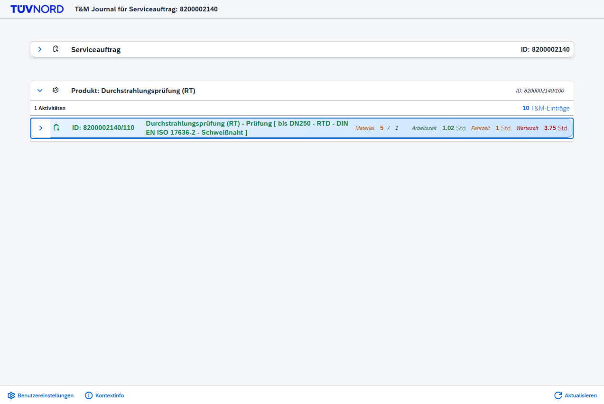
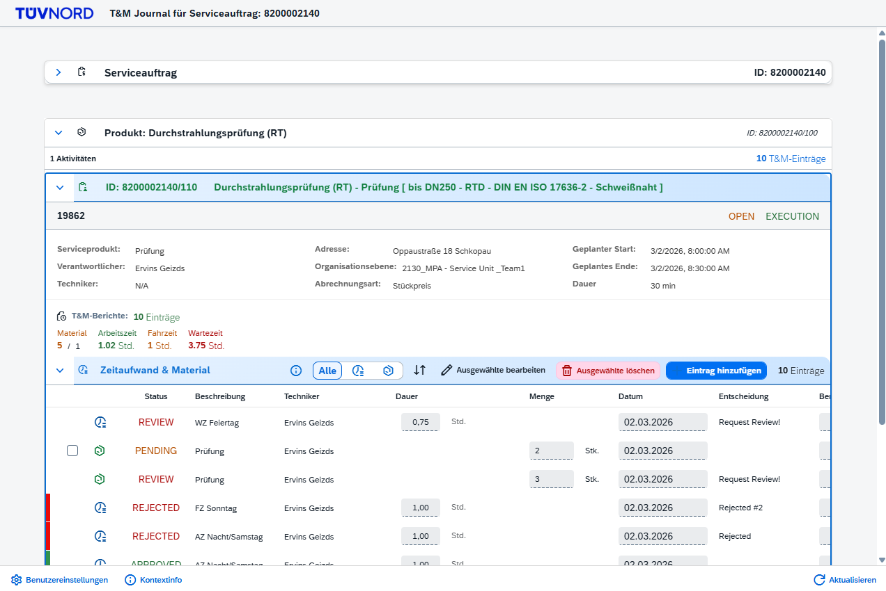
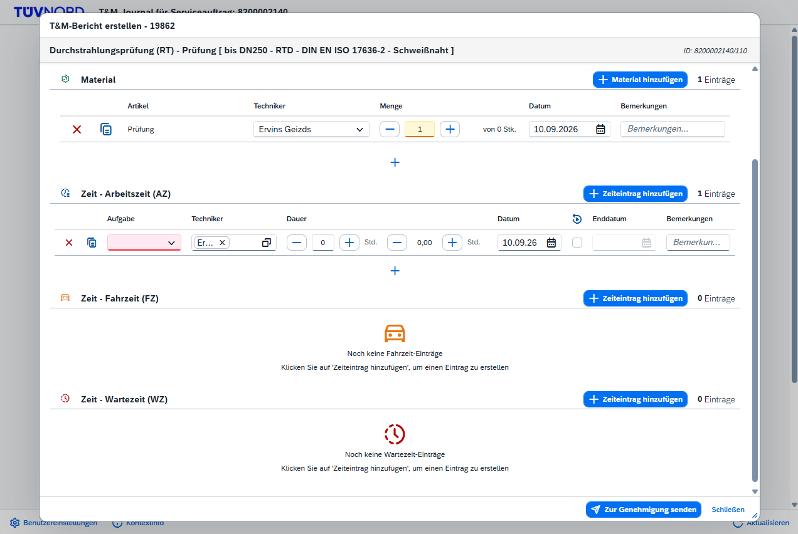
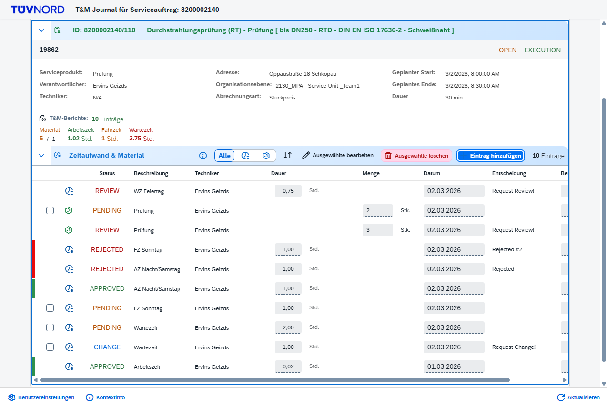
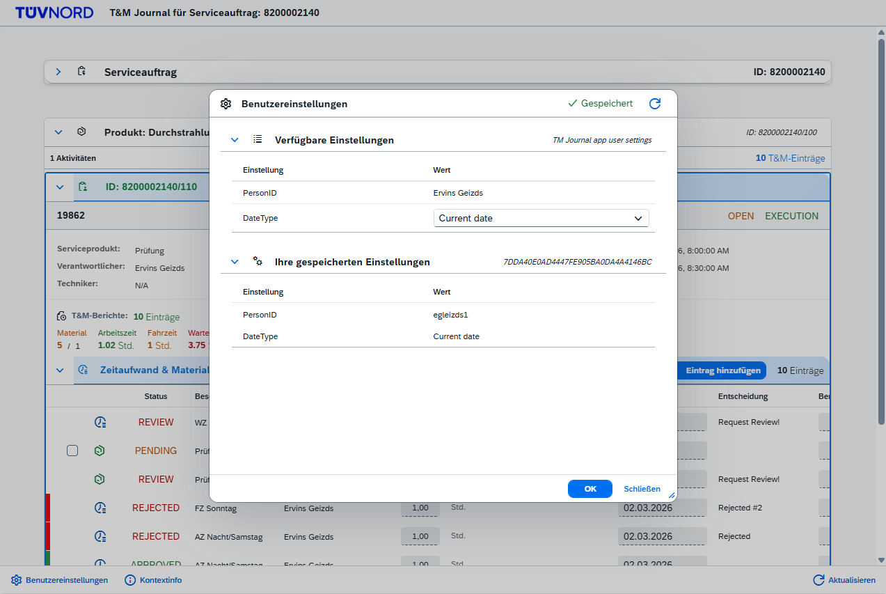

# T&M Journal - FSM Mobile Integration App

A SAP Fiori mobile application for SAP Field Service Management (FSM), designed to run in FSM Mobile (Web Container), FSM Web UI (Shell Extension), or standalone browser. Features T&M (Time & Materials) reporting with automatic organization level resolution, context-aware activity highlighting, per-user settings stored in FSM, and configurable entry types.

> **Version:** 0.0.1  
> **Platform:** SAP BTP Cloud Foundry  
> **Last Updated:** September 2026

---

## ⚠️ Configuration Notice: Expense & Mileage Disabled

**By customer request, Expense and Mileage entry types are disabled.** All Service
Product IDs — including those previously treated as Expense or Mileage — now resolve
to **Time & Material**, so everything is reported through the Material/Time path.

**How it works:** the Expense/Mileage type lists are set to **empty**. Because
`TypeConfigService.isTimeMaterialType()` is the catch-all (true for any ID not in the
Expense or Mileage lists), an empty configuration routes every ID to Time & Material.
The Expense/Mileage creation panels and inline tables are visibility-bound to
`isExpenseType()` / `isMileageType()`, so they never appear while the lists are empty.

**What was changed (config only — no code removed):**

| File | Change |
|------|--------|
| `config/typeconfig.json` | `expenseTypes` and `mileageTypes` set to `[]` |
| `config/TypeConfigStore.js` | `DEFAULT_CONFIG` expense/mileage arrays emptied (required — CF file storage is ephemeral, so the store falls back to `DEFAULT_CONFIG` on restart/redeploy). Original IDs preserved in a comment. |
| `webapp/utils/services/TypeConfigService.js` | `DEFAULT_EXPENSE_TYPES` / `DEFAULT_MILEAGE_TYPES` fallback constants emptied (used only on API failure). Original IDs preserved in comments. |

> **Note:** All four defaults must stay empty together. Emptying only
> `typeconfig.json` is not durable — on the next redeploy the backend
> `DEFAULT_CONFIG` and the frontend fallback would re-enable the old IDs.

**The Type Configuration DIALOG is also dormant.** The footer settings button now opens
**User Settings** instead. The dialog's code was not deleted — it lives in
`webapp/controller/mixin/TMTypeConfigurationMixin.js`, is still mixed into the
controller, and simply has no caller. See
[Type Configuration (dormant)](#-type-configuration-dormant) for how to bring it back.

> `TypeConfigService` itself is **not** dormant. It still runs at startup and classifies
> every activity as Expense / Mileage / Time & Material. Only the editing UI is switched
> off; the lists stay editable through the `/api/v1/*-type-config` endpoints.

**What was deliberately left in place (for possible future re-enable):**

- **Frontend creation/edit:** `TMExpenseMileageMixin.js`, expense/mileage branches in
  `TMDialogService.js`, `TMDialogMixin.js`, `TMEditMixin.js`, `TMTableMixin.js`,
  `TMCreationService.js`, `TMPayloadService.js` (`buildExpensePayload`, `buildMileagePayload`)
- **Frontend retrieval/UI:** `FSMQueryService.js` (`getExpensesForActivity`,
  `getMileagesForActivity`), `ReportedItemsData.js`, `ExpenseTypeService.js`,
  Expense/Mileage panels in `TMCreateDialog_fragment.xml` and tables in `ProductGroups_fragment.xml`
- **Type Config dialog:** `TypeConfigDialog_fragment.xml`, `TMTypeConfigurationMixin.js`,
  `TypeConfigService.js` add/remove handlers, `configRoutes.js`, and the
  `TypeConfigStore.js` CRUD/reset methods
- **Backend:** `entryRoutes.js` (`/create-expense`, `/update-expense/:id`, `/create-mileage`,
  `/update-mileage/:id`), `FSMService.js` (`createExpense`, `updateExpense`, `createMileage`,
  `updateMileage`, and the `Expense`/`Mileage` batch type-map entries)
- **i18n:** all Expense/Mileage keys in `i18n.properties` / `i18n_de.properties`

**To re-enable Expense and Mileage in the future,** restore the original IDs in all
three config locations (the original values are preserved as comments in
`TypeConfigStore.js` and `TypeConfigService.js`):

```
expenseTypes: ["Z40000001", "Z40000007", "Z50000000"]
mileageTypes: ["Z40000038", "Z40000008"]
```

or add them back at runtime via the Type Config dialog once it is re-enabled. No code
needs to be re-written — the paths are dormant, not deleted.

---

## 👥 Activity Visibility: Org Level, then Team, then Assignment

Visibility is decided in `DataLoadingMixin._loadServiceCallActivities()` in three steps,
**identically on FSM Mobile and in the FSM Web UI**.

### Step 1 — Organization level (always)

| Condition | Result |
|-----------|--------|
| User has no resolved org level | No activities. Message: *No Organization Level Assigned* |
| Activity's `orgLevelIds` matches the user's org level | Continues to step 2 |
| Activity's org level differs | Hidden, counted in the *activities hidden* toast |

> **Exact match, no hierarchy.** The user resolves to exactly **one** org level
> (`Person.orgLevel`, falling back to the first entry of `Person.orgLevelIds` that exists
> in the hierarchy), and an activity is compared against that single id. Parents and
> children are **not** walked: a dispatcher sitting on a parent unit sees none of the
> activities of the teams beneath it. `OrganizationService._processLevelsRecursive()`
> flattens the tree into an id → name map and discards `subLevels`, so the parent/child
> relationship is not even retained. The company root is excluded from that map (the
> recursion starts at `level.subLevels`), so an object stamped with the root matches nobody.
>
> If hierarchy is ever needed, keep `parentId` when caching, resolve the user to a **set**,
> and expand it downwards.

### Step 2 — GATE A: the service call's team

If the logged-in user belongs to the **team on the service call**, they see **every**
activity of that service order and step 3 is skipped.

The team is resolved server-side, because the `team` field is **not** part of the
composite-tree payload the app already loads. `FSMService.getServiceCallTeamPersons()`
joins the two entities in a single query:

```sql
SELECT v.person FROM ServiceCall m
JOIN TeamTimeFrame v ON v.team = m.team
WHERE m.id = '<service call UUID>'
```
`dtos=ServiceCall.27;TeamTimeFrame.11`

Keyed on `ServiceCall.id` rather than `.code` — the id is the value the app holds in every
entry path, and needs no assumption about code formatting or uniqueness. `TeamTimeFrame`
is one row per person per time frame, so rows are de-duplicated; `validFrom` / `validTo`
are deliberately **not** evaluated, so a technician whose frame ended does not lose sight
of the service order they worked on.

### Step 3 — GATE B: per-activity assignment

For a non-member, an activity is visible only if the user is its **responsible** or one of
its **supporting technicians**.

The composite tree carries `responsibles` but **not** `supportingPersons`, so
`ActivityService.fetchActivityTechnicians()` is called for the activities that need it
(five at a time). The two lists are then taken **independently** — tree first, fetch as
fallback, per list — because an all-or-nothing choice loses whichever one the other source
held.

> ⚠️ `_hasAssignmentData()` must stay an **AND** of both lists. As an OR, an activity
> looked fully described from the tree alone, the lookup never ran, and supporting
> technicians were never checked — a user who was *only* a supporting technician saw an
> empty list with no error.

### Neither gate matches

No activities, and the empty state says why (`msgNoActivitiesAccessTitle` /
`msgNoActivitiesAccessDesc`): *neither a member of its team nor assigned to any of them*.

### Failing closed

Every uncertain case denies rather than grants: no service call id, no team, an empty team,
a failed team lookup, a failed assignment lookup, or an unresolved person identity. A
problem can only ever hide activities, never reveal them.

### Identity matching

Both gates compare against **every** value the user can be referenced by — `personIds`,
`personExternalIds` and `personRefIds`, collected by `_getUserIdentityKeys()`. One human
has several Person rows with different ids *and* different externalIds, and FSM references
different ones in different places (a `TeamTimeFrame` names a Person id; an activity's
responsible may carry either). Matching a single identity silently hides everything for
some users. See [Person identity](#the-person-identity).

### Not a security boundary

The filtering happens in the browser. The backend calls FSM with **OAuth2 client
credentials** — a technical client with no user identity — so FSM Policy Groups are never
evaluated, and the `/api/v1/*` routes still serve any authenticated session the full data.
This is an ergonomic restriction. Making it an actual one means moving both gates into the
Node layer.

> **Why not FSM Policy Groups?** They govern FSM's own screens. An extension never receives
> them: in the Web UI the shell can be *asked* (`SHELL_EVENTS.Version3.GET_PERMISSIONS`),
> but that answer is a UI hint that does not filter query results; in the Mobile Web
> Container there is no shell at all — see [FSM Mobile Integration](#-fsm-mobile-integration).

---

## ⚙️ User Settings (FSM UDO)

Each technician has their own settings record, stored in FSM as the **UDO
`TMExt_UserSettings`**. The footer settings button opens the dialog.

### What the dialog shows

**One table**, three columns — one row per field the UDO can hold, in FSM's own field order:

| Column | Content |
|--------|---------|
| **Setting** | The field's `description` from FSM. |
| **Value** (editable) | A dropdown of the field's selection list, pre-filled with what the user saved, falling back to the field's default. A `PERSON` field shows the user's name instead of a dropdown. |
| **Applied** | What is stored in FSM **right now**, resolved to readable text (a selection code shows as its text, a person externalId as the name). An **en dash** means nothing has been saved for that setting — distinguishable from *saved as empty*. |
| **OK** | Creates the record, or updates the existing one. |

Editable and stored values sit on the **same row**, so "what I am about to save" versus
"what is saved" is one glance. (This replaced a separate *Your Saved Settings* table below,
which had to be cross-referenced by eye.)

The stored value is matched to its definition row by UDF `externalId` **and** by meta UUID,
so a record written before a field was renamed in FSM still lines up. A person value is only
rendered as the user's name when it is one of *their* identities — a value belonging to
someone else stays raw rather than being mislabelled.

Only the user's own record is read: other people's are filtered out **server-side** and
never reach the browser.

### Nothing about the settings is hardcoded

Everything a field does comes from its own `UdfMeta`, so a setting added in FSM tomorrow
renders correctly with **no code change**:

| FSM metadata | Drives |
|--------------|--------|
| `description` | the label in the Setting column |
| `selectionKeyValues` | the dropdown options |
| `defaultValue` | which option is preselected |
| `referencedObjectType` | a `PERSON` field is filled with the logged-in user |

The only exception is `KNOWN_FIELD_CONFIG` in `utils/FSMUdoService.js`, which covers the
two things FSM's metadata cannot express for the always-present fields. It is keyed by
the field's `externalId` and is **strictly additive** — a field with no entry still
renders normally, and a stale key logs a warning rather than failing silently.

```js
const KNOWN_FIELD_CONFIG = {
    'z_TM_DateType': { defaultCode: '2', role: 'ENTRY_DATE' },
    'z_TM_PersonID': { fill: 'PERSON_EXTERNAL_ID' }
};
```

> FSM's own `UdfMeta.defaultValue` always wins over `defaultCode`. Set the default in FSM
> Admin and the config entry becomes removable.

### selectionKeyValues and stored values

FSM returns the list as `{ "<code>": "<display text>" }`, e.g.
`{ "1": "Current date", "2": "Dispo date" }`. A **write stores the code** (`"1"`).
Records created by hand in FSM may hold the display text instead, so reads accept either
and translate to the text for display.

### Reading

Three queries, a fixed count no matter how many settings or records exist:

```sql
-- 1. the definition (fields, in order)
SELECT w FROM UdoMeta w WHERE w.name = 'TMExt_UserSettings'

-- 2. the stored records
SELECT v FROM UdoValue v JOIN UdoMeta m ON v.meta = m
WHERE m.name = 'TMExt_UserSettings'

-- 3. ONE query resolving every UDF meta UUID from 1 and 2 together
SELECT w FROM UdfMeta w WHERE w.id IN (...)
```

1 and 2 run in parallel, then 3 resolves the union. The resolution happens **server-side**
on purpose: doing it from the browser would be one request per UUID — the N+1 pattern
that caused the random-PENDING bug documented in `getApprovalStatusBatch`.

> Filtering a UdoValue by one of its UDFs (`... AND v.udf.z_TM_PersonID = '...'`) is not
> supported by the Query API. The person's record is matched in Node instead, against
> data query 2 already returned — no extra round trip.

### Writing (create *and* update)

Both are a `PATCH`; only the target differs, and which one runs is decided by looking the
person up first:

| | Target | Why |
|---|---|---|
| **Update** | `/api/data/v4/UdoValue/{id}` | the record's own id, so a record created by hand in FSM (no `externalId`) is updated **in place** instead of duplicated |
| **Create** | `/api/data/v4/UdoValue/externalId/{externalId}` | FSM upserts it |

Both with `?dtos=UdoValue.10&account=..&company=..&forceUpdate=true` and the standard
header block including `X-Client-ID` and `X-Client-Version`.

The record externalId is derived, never stored anywhere else:

```
<UdoMeta id>_<person externalId>
67F7CD54D1B24F4D8B7B715DEFAB472E_egleizds1
```

Unique per person per UDO, so two devices saving at once are idempotent — same key, no
duplicates. Empty fields are skipped rather than written as `""`.

```json
{
  "externalId": "67F7CD54D1B24F4D8B7B715DEFAB472E_egleizds1",
  "meta": "67F7CD54D1B24F4D8B7B715DEFAB472E",
  "udfValues": [
    { "meta": { "externalId": "z_TM_PersonID" }, "value": "egleizds1" },
    { "meta": { "externalId": "z_TM_DateType" }, "value": "2" }
  ]
}
```

### The person identity

`z_TM_PersonID` is filled with the logged-in user's **Person externalId**, resolved once
at startup — no extra lookup:

```
userName → User API (user id) → Person.userName  → id, refId, type, externalId, names
                              ↘ fallback: UnifiedPerson.userName
                                (accounts where Person.userName holds the login name)
```

Whichever path answered is the one used. The table shows `firstName lastName`
(`personDisplayName`) while the model keeps the `externalId` — that is what a save writes.

#### One human, several Person rows

FSM stores one `Person` row **per type** for the same human — an `ERPUSER` row and an
`EMPLOYEE` row — each with its **own id and its own externalId** (e.g. `egleizds1` and
`egleizds2`), sharing one `refId`. Three consequences, all handled in `FSMLookupService`:

**1. The rows are ranked, never taken in FSM's order.** `identityRank()` prefers `ERPUSER`,
then `id === refId`, then `EMPLOYEE`. FSM promises no row order, and `[0]` ends up in
stored data (`z_TM_PersonID`) — an unranked `[0]` is a lottery, and a flip writes a
**second** settings record under the other externalId, silently orphaning the first.

ERPUSER is the right anchor: it satisfies FSM's documented preferred relationship
(`Person[ERPUSER].id = refId = UnifiedPerson.id`) and — verified in this tenant — it is the
row FSM's own Mobile/Web UI writes into `createPerson` on the TimeEfforts it creates, so our
entries point at the same Person FSM does.

**2. Reads match the whole identity set, not one value.** `findUserSettingRecordForPerson()`
compares the stored `z_TM_PersonID` against **every** externalId the user resolves to, so a
record saved under either row is found and updated rather than duplicated. New records are
still keyed on the primary only. Called with **no** identity, `getUserSettings()` returns
**no** records — previously it returned everyone's, and the dialog showed a stranger's
values as the user's own.

**3. The technician list is de-duplicated by `refId`.** `getPersons()` returns one entry per
human, keeping the ERPUSER row; without it a technician appeared twice and picking the wrong
one wrote a `createPerson` that FSM's own apps never use. The merged entry carries every
identity in `ids` / `externalIds`, and `PersonService` caches it under all of them, so a
lookup by the collapsed identity — which is what an activity's `supportingPersons` often
names — still resolves.

`getPersonById()` / `getPersonByExternalId()` fall back to `UnifiedPerson` when `Person`
returns nothing. Both ids resolve in `Person` today; this is insurance against SAP's
documented warning that the `Person[ERPUSER].id = UnifiedPerson.id` link **will** break
during the migration.

> ⚠️ **`Person.externalId` is required.** A Person created directly in FSM has
> `externalId: null` on every row. The org level still resolves (so activities load fine),
> but `personExternalIds` comes back empty and **User Settings cannot be saved** —
> *"Your user is not assigned to a person…"*. Set an externalId on the **ERPUSER** row in
> FSM Admin. See [FSM User Settings UDO](#fsm-user-settings-udo).

### What the settings control

| Setting | Code | Effect |
|---------|------|--------|
| **DateType** | `2` Dispo date | A new T&M entry defaults to the **activity's planned start date** (the long-standing behaviour) |
| | `1` Current date | A new T&M entry defaults to **today**, in the company time zone |

`/defaultDate` in the createTM model is the single place this is applied — **every** row
type reads it (time AZ/FZ/WZ, material, expense, mileage), so `TMDialogService` sets it
once from `UserSettingsService.resolveEntryDate()`.

The setting is found **by role** (`ENTRY_DATE`), not by name. It falls back to the planned
start date whenever the setting is missing, unreadable or unknown, so behaviour without
settings is exactly what it was before they existed.

> "Today" means today in the **company** time zone, not the device's — the same rule
> `TimeZoneService` documents for time efforts. A technician's phone travelling abroad
> must not move a workday onto a different calendar date.

### Loading

Two layers, no startup race:

- **Warm** — fired right after the person resolves in `_loadOrganizationLevels()`
  (fire-and-forget), so the first *Add Entry* does not wait.
- **Guarantee** — `ensureLoaded()` joins the `Promise.allSettled` batch the creation
  dialog already runs for tasks/items/expense types. Cached after the first call; a
  failure only means the planned-date fallback.

`UserSettingsService.clearCache()` is part of `_clearAllServiceCaches()`, so the Refresh
button re-reads the settings too.

---

## ⏰ Time Entries: Fixed 00:01 Start & Summer/Winter (DST) Handling

**Every time effort is created with a start time of 00:01 on its own date**, not at the
activity's planned start time. The entry's date comes from the row's `Datum`; only the
time-of-day is fixed to 00:01. Duration is then added on top (end = 00:01 + duration).

**Why 00:01:** FSM validates each time effort's **local** date against "today" and rejects
future dates (`CA-238` — *"Das eingegebene Datum darf nicht in der Zukunft liegen"*). Some
activities have a `plannedStartDate` late in the evening (e.g. 23:00 local); starting there
and adding a multi-hour duration pushed the block past midnight into the **next** day, which
FSM treated as a future date and rejected. Anchoring the start at 00:01 keeps the whole block
(00:01 + duration) inside the entry's own date for any realistic duration.

**Why summer/winter (DST) matters here:** FSM stores each time effort against
`startDateTimeTimeZoneId` (set in `TMPayloadService`), so the value FSM validates is the
**local wall-clock time**, not the raw UTC instant we send. To land on 00:01 Berlin we must
send the UTC instant that Berlin reads as 00:01, and that differs by season:

| Period | Berlin offset | UTC instant sent for 00:01 Berlin |
|--------|---------------|-----------------------------------|
| Winter (CET, standard time) | UTC+01:00 | `23:01Z` of the **previous** day |
| Summer (CEST, DST)          | UTC+02:00 | `22:01Z` of the **previous** day |

EU summer time runs from 01:00 UTC on the last Sunday in March to 01:00 UTC on the last
Sunday in October. Sending a naive `00:01Z` would be read by FSM as 01:01 (winter) or 02:01
(summer) Berlin — usually the right date, but not truly 00:01 and fragile near midnight. So
the conversion is **DST-aware**.

### Single source of truth: `TimeZoneService`

The zone used to **compute** the instant and the zone **sent to FSM** must always be
identical. If they drift apart, entries silently land on the wrong calendar day near
midnight. Both now resolve from one module:

`webapp/utils/services/TimeZoneService.js`

| Method | Purpose |
|--------|---------|
| `get()` | the active company zone (IANA id) — the only value any payload or date helper uses |
| `set(tzId, source)` | override it; rejects ids that `Intl` cannot resolve, so a bad value cannot break every timestamp |
| `getSource()` | provenance label, shown in the Context Info dialog |
| `getDeviceZone()` / `hasDeviceMismatch()` | the device's own zone — **display and diagnostics only** |

`DEFAULT_TZ = "Europe/Berlin"` is the single constant to change for a different zone.

> **The device zone is deliberately NOT a source.** It varies with wherever the technician's
> phone happens to be, and the workday date is a payroll fact tied to the company, not to the
> device. Using it would mean the same entry anchoring to a different real instant depending
> on where it was typed. It is surfaced in the Context Info dialog purely so a wrong-day
> report can be diagnosed at a glance. The same rule governs the *Current date* user setting.

**Sourcing the zone externally (not currently done).** A `GET_SETTINGS` probe against
`timeZone`, `timezone`, `TimeZone`, `companyTimeZone`, `CoreSystems.Company.TimeZone` and
`CoreSystems.Timezone` returned `null` for every one, while documented keys (`userPerson`,
`CoreSystems.FSM.StandaloneCompany`) answered normally — so the mechanism works and FSM
simply does not publish a readable company time zone. `REQUIRE_CONTEXT` carries no zone
either (only `selectedLocale`, which is not a zone). `GET_SETTINGS` is additionally
**Web-UI-only**: the Mobile WebContainer has no Shell SDK, so a Shell company setting would
make Web UI and Mobile disagree. If a configurable zone is ever needed, serve it from the
**backend** (both clients can read it) and call `TimeZoneService.set()` once during startup,
before any payload is built.

### Where it's implemented

**`TMSaveMixin.js` — create path**
- `_localToUtc(dateStr, hours, minutes)` resolves the zone's offset for the specific date via
  the `Intl` API (no external timezone library) and returns the correct UTC `Date`.
- The time-effort build loop calls `this._localToUtc(entryDateStr, 0, 1)` for every entry.

**`DateTimeService.js` — edit path and offset labels**
- `toZonedDateString(iso, tzId)` — the local calendar date of a stored UTC instant.
- `zonedDateToAnchorUtc(dateStr, h, m, tzId)` — rebuilds the anchor when an edited entry is
  re-saved. Pasting the old UTC time portion onto a new date would shift the entry by the
  offset and roll the date over near midnight.
- `getUtcOffsetLabel(at, tzId)` — see below.
- `toBerlinDateString()` and `berlinDateToAnchorUtc()` are retained as deprecated aliases so
  existing callers in `TMDialogMixin` and `TMTableMixin` keep working; both delegate to the
  zoned versions and resolve their zone from `TimeZoneService`.

**`TMPayloadService.js` — payload fields**
- `startDateTimeTimeZoneId` / `endDateTimeTimeZoneId` (and the Mileage `travel*TimeZoneId`
  fields) come from `TimeZoneService.get()`.
- `timeZoneId` is computed per entry — see the next section.

### The `timeZoneId` offset field

`timeZoneId` was previously hardcoded to `"UTC+02:00"`, which is **wrong for roughly five
months of every year** (Berlin is UTC+01:00 outside EU summer time). It is now resolved by
`DateTimeService.getUtcOffsetLabel()`, which uses `Intl` `timeZoneName: 'longOffset'` with a
format-and-compare fallback for engines that lack it.

> **Critical:** the label is resolved against **the entry's own `startDateTime`**, never
> against `new Date()`. A January entry created in July must report `UTC+01:00`. For this
> reason `timeZoneId` is deliberately **not** part of the shared `timeEffortConstants` object
> in `buildTimeAndMaterialPayload` — putting it there is what produced the original bug.

**DST transition days are safe:** Germany switches at 02:00/03:00, never at midnight, so
00:01 is always unambiguously on the correct side of the switch (no skipped or repeated local
time at 00:01).

**Verified in QA** — batch-created entries spanning the boundary, on both Mobile WebContainer
and Web UI Shell, each rendering on the correct day in FSM:

| Entry date | UTC instant sent | `timeZoneId` | FSM shows |
|------------|------------------|--------------|-----------|
| 2026-01-07 | `2026-01-06T23:01Z` | `UTC+01:00` | 07/01/2026, 00:01 |
| 2026-03-18 | `2026-03-17T23:01Z` | `UTC+01:00` | 18/03/2026, 00:01 |
| 2026-03-31 | `2026-03-30T22:01Z` | `UTC+02:00` | 31/03/2026, 00:01 |
| 2026-06-16 | `2026-06-15T22:01Z` | `UTC+02:00` | 16/06/2026, 00:01 |

All four were created in the same batch on the same day, so the differing offsets confirm
per-entry resolution rather than a single value derived from "now". FSM accepted `UTC+01:00`
without a validation error.

> **Open question:** whether FSM reads `timeZoneId` at all, or only
> `startDateTimeTimeZoneId`. FSM renders the zone as an IANA name, suggesting the latter —
> which would explain why the long-standing wrong value never surfaced a visible bug. The
> field is now correct either way.

### Context Info dialog

The Session Context dialog shows the active zone and its provenance, e.g.
`Europe/Berlin (default)`. A **Device Zone** row appears only when the device sits in a
different zone — informational, nothing computes against it.

> These fields are supplied by `DataLoadingMixin._timeZoneModelFields()` and spread into
> **every** assignment to `/webContainerContext`. That model property is replaced wholesale
> on initial load *and again on Refresh*, so fields set separately afterwards get silently
> wiped. Any future field on that object must be added the same way.

---

## Documentation

- [docs/SETUP.md](docs/SETUP.md) — fresh deployment to a new BTP subaccount
- [docs/RENAME.md](docs/RENAME.md) — renaming an existing app to comply with naming conventions
- [docs/NAMING.md](docs/NAMING.md) — naming convention reference for all tns FSM extensions
- [docs/SECURITY.md](docs/SECURITY.md) — security architecture and threat model

---

## 📋 Table of Contents

- [Screenshots](#-screenshots)
- [Overview](#-overview)
- [Architecture](#-architecture)
- [Features](#-features)
- [T&M Entry Statuses](#-tm-entry-statuses)
- [Activity T&M Summary](#-activity-tm-summary)
- [Prerequisites](#-prerequisites)
- [Setup & Deployment](#-setup--deployment)
- [FSM Mobile Integration](#-fsm-mobile-integration)
- [FSM Web UI Integration](#-fsm-web-ui-integration)
- [Standalone / Development Mode](#-standalone--development-mode)
- [Expected Result](#-expected-result)
- [How It Works](#-how-it-works)
- [API Reference](#-api-reference)
- [Troubleshooting](#-troubleshooting)
- [Application Details](#-application-details)
- [Current Status](#-current-status)
- [Security Notes](#-security-notes)

---

## 📸 Screenshots

Screenshot folder: `docs/screenshots/`

> Some screenshots below show features that are currently **disabled or dormant**
> (Expense, Mileage, Type Configuration). They are kept because the code behind them was
> preserved rather than deleted — see the [Configuration Notice](#️-configuration-notice-expense--mileage-disabled)
> and [Type Configuration (dormant)](#-type-configuration-dormant).

### 1. Main View - Session Context & Service Order



| Element | Description | Key Files |
|---------|-------------|-----------|
| **Session Context Button (ℹ️)** | Opens Session Context dialog: User, Language, Account, Company, Organization, Object Type, time zone | `TimeMaterialExt.controller.js` → `onShowContextInfo()`, `ContextInfoDialog.fragment.xml` |
| **User Settings Button (⚙️)** | Opens the User Settings dialog (FSM UDO `TMExt_UserSettings`) | `TMUserSettingMixin.js` → `onOpenUserSettings()`, `UserSettingsDialog.fragment.xml` |
| **Refresh Button** | Clears every service cache and reloads | `TimeMaterialExt.controller.js` → `onRefresh()` |
| **Service Order Panel** | Expandable panel with Service Order details | `ServiceCall.fragment.xml` |

> The ⚙️ button previously opened Type Configuration. The control id
> (`mobileAppTypeConfigButton`) was deliberately left unchanged so existing CSS keeps
> matching — only its text and press handler changed.

---

### 2. Product Groups & Activities



| Element | Description | Key Files |
|---------|-------------|-----------|
| **Product Group Headers** | Activities grouped by Service Product description | `ProductGroups.fragment.xml`, `ProductGroupService.js` |
| **Activity Panel** | Expandable panel with activity details (3-column CSS Grid layout) | `ProductGroups.fragment.xml` |
| **Context Highlighting** | Light blue border on entry activity | `style.css` → `.activityEntryPanel[data-highlighted="true"]` |
| **T&M Summary** | Material qty and AZ/FZ/WZ hours, each coloured by the statuses behind it — see [Activity T&M Summary](#-activity-tm-summary) | `TMDataService.js` → `resolveSummaryState()`, `ProductGroups.fragment.xml`, `style.css` |
| **T&M Tables** | Inline tables for Time/Material (with sort, filter, edit, delete) | `ProductGroups.fragment.xml`, `TMTableMixin.js` |
| **Add Entry Button** | Opens T&M Creation dialog | `TMDialogService.js` → `openTMCreationDialog()` |
| **Delete Selected Button** | Batch deletes selected **PENDING** or **CHANGE** entries | `TMTableMixin.js` → `onDeleteSelectedTM()` |

> Every activity shown matches the user's organization level. The app no longer filters by
> responsible/supporting technician — see [Activity Visibility](#-activity-visibility-organization-level-only).

---

### 3. T&M Creation Dialog - Time & Material



| Element | Description | Key Files |
|---------|-------------|-----------|
| **Activity Header** | Shows activity details (dates, duration, quantity) | `TMCreateDialog.fragment.xml` |
| **Material Section** | Technician, Item, Quantity, Date, Remarks | `TMCreateDialog.fragment.xml`, `TMMaterialMixin.js` |
| **Time Sections** | Arbeitszeit (AZ), Fahrzeit (FZ), Wartezeit (WZ) with Task dropdown | `TMCreateDialog.fragment.xml`, `TMTimeEntryMixin.js` |
| **Multi-Technician** | MultiInput with token-based selection from activity technicians | `TechnicianService.js`, `TechnicianMixin.js` |
| **Task Dropdown** | Filtered by category (AZ, FZ, WZ) | `TimeTaskService.js` |
| **Date** | Pre-filled per the user's **DateType** setting: *Dispo date* → activity planned start, *Current date* → today | `TMDialogService.js` → `/defaultDate`, `UserSettingsService.resolveEntryDate()` |
| **Repeat Date Range** | Checkbox + end date to create entries across multiple days | `TMTimeEntryMixin.js` |
| **Save All** | Batch creates all Material + Time entries | `TMSaveMixin.js` |

**Visibility:** shown for every Service Product ID while Expense/Mileage are disabled.

---

### 4. T&M Creation Dialog - Expense *(disabled)*


Kept for reference — the Expense type list is empty, so this panel never appears.
Code preserved in `TMExpenseMileageMixin.js` and the Expense panel of
`TMCreateDialog.fragment.xml`.

**Type Check:** `TypeConfigService.isExpenseType(serviceProductId)`

---

### 5. T&M Creation Dialog - Mileage *(disabled)*


Kept for reference — the Mileage type list is empty, so this panel never appears.
Code preserved alongside Expense.

**Type Check:** `TypeConfigService.isMileageType(serviceProductId)`

---

### 6. T&M Tables (Inline)



| Element | Description | Key Files |
|---------|-------------|-----------|
| **Time/Material Table** | Combined table with type filter (All / Time Effort / Material) | `ProductGroups.fragment.xml` |
| **Status Badge** | `PENDING`, `REVIEW`, `APPROVED`, `CHANGE`, `REJECTED`, `CANCELLED` — see [T&M Entry Statuses](#-tm-entry-statuses) | `ApprovalService.js`, `ProductGroups.fragment.xml` |
| **Status Legend (ℹ️)** | Explains each status and what a supervisor action changes | `StatusLegendDialog.fragment.xml` |
| **Decision Column** | Approver's decision remarks | `ApprovalService.js` → `getRemarksById()` |
| **Row Selection** | Checkbox renders only for **PENDING** and **CHANGE** | `ProductGroups.fragment.xml` |
| **Inline Edit** | Edit Selected → modify values → Save All (batch update) | `TMTableMixin.js` → `onSaveAllTM()` |
| **Batch Delete** | Select rows → Delete Selected | `TMTableMixin.js` → `onDeleteSelectedTM()` |
| **Sort & Filter** | Per-table dialog: status and technician | `TMSortDialog.fragment.xml` |

> If this screenshot still shows a `DECLINED` badge, it predates the rename:
> FSM `DECLINED` now displays as **CHANGE** and `DECLINED_CLOSED` as **REJECTED**.

---

### 7. Type Configuration Dialog *(dormant)*


No control opens this dialog any more — the ⚙️ button opens User Settings instead. The
handlers live in `TMTypeConfigurationMixin.js` and the fragment is unchanged, so the
screenshot stays valid for whenever it is re-enabled. See
[Type Configuration (dormant)](#-type-configuration-dormant).

---

### 8. User Settings Dialog



| Element | Description | Key Files |
|---------|-------------|-----------|
| **Available Settings** | One row per field of the UDO, pre-filled with the user's saved choice or the field default | `TMUserSettingMixin.js` → `_loadUserSettingsIntoModel()` |
| **Setting column** | The UDF's `description`, resolved from its meta UUID server-side | `FSMUdoService.js` → `buildLabel()` |
| **Value column** | Dropdown of the UDF's selection list; plain text for other fields (a PERSON field shows `firstName lastName`) | `UserSettingsDialog.fragment.xml` |
| **Applied column** | What is stored in FSM right now, resolved to readable text. An en dash means nothing saved for that setting. Pops in below the row at phone width. | `TMUserSettingMixin.js` → `savedDisplayValue` |
| **Saved indicator** | Green ✓ in the header when the user has a saved record | `UserSettingsDialog.fragment.xml` |
| **OK** | Creates the record, or updates the existing one. Only the user's own record is read — others never reach the browser. | `FSMUdoService.js` → `getUserSettings(name, personExternalIds)` |

---

### 9. Mobile Responsive View


| Element | Description | Key Files |
|---------|-------------|-----------|
| **Responsive Layout** | CSS Grid `auto-fit, minmax(280px, 1fr)` adapts columns to screen width | `style.css` |
| **Collapsed Panels** | Panels collapse to save space; the collapsed activity header carries its own T&M summary | `ProductGroups.fragment.xml` |
| **Touch-friendly** | 44px minimum tap targets on touch devices | `style.css` |

**Breakpoints:**
- Desktop: hover effects, lift animation (>1024px)
- Tablet: 2 columns, wrapped toolbars (601px–1024px)
- Mobile: 1 column, full-width dialogs (<600px)
- Extra small: hidden ID labels (<400px)

**The collapsed activity header sheds content in three tiers.** A long subject used to wrap
into a tall tower and push the T&M summary out of view:

| Width | Header shows |
|-------|--------------|
| > 600px | ID + subject (clamped to two lines, full text in the tooltip) + summary with labels |
| ≤ 600px | ID + bare summary numbers. The subject moves into the expanded detail (`.activityDetailSubject`), centred and padded to the panel gutter, so it is never lost |
| ≤ 400px | ID only (`.activityHeaderSummary` hidden) — below this the numbers were cut off mid-word and squeezed the ID into an ellipsis. The summary is still there once the panel is expanded |

> The subject clamp relies on `display: -webkit-box` + `-webkit-box-orient: vertical`;
> removing either breaks `-webkit-line-clamp`. The standard `line-clamp` is declared
> alongside it for forward compatibility.
>
> Every control of the collapsed summary carries the `activityHeaderSummary` class so one
> rule hides the whole group — add the class to anything new put there.

---

### Screenshot Checklist

| # | File | Shows | Status |
|---|------|-------|--------|
| 1 | `01-main-view.png` | Session Context + Service Order | ⚠️ Re-take — footer button is now **User Settings** |
| 2 | `02-product-groups.png` | Product Groups & Activities | ⚠️ Re-take — summary colours are new |
| 3 | `03-tm-creation-time-material.png` | T&M Creation - Time & Material | ✅ Still valid |
| 4 | `04-tm-creation-expense.png` | T&M Creation - Expense | ✅ Reference only (disabled) |
| 5 | `05-tm-creation-mileage.png` | T&M Creation - Mileage | ✅ Reference only (disabled) |
| 6 | `06-tm-tables.png` | T&M Tables (Inline) | ⚠️ Re-take — `DECLINED` is now `CHANGE`, `DECLINED_CLOSED` is `REJECTED` |
| 7 | `07-type-config.png` | Type Configuration Dialog | ✅ Reference only (dormant) |
| 8 | `08-mobile-responsive.png` | Mobile Responsive View | ✅ Still valid |
| 9 | `09-user-settings.png` | User Settings Dialog | ⬜ **Missing — new dialog** |

---

## 🎯 Overview

This application provides a mobile-optimized interface for viewing and managing FSM activities with T&M (Time & Materials) reporting. It integrates with FSM Mobile (Web Container) and FSM Web UI (Shell Extension).

**Key Features:**
- ✅ Progressive disclosure UI (Service Order → Product Groups → Activities → T&M Tables)
- ✅ Organization level auto-resolution from logged-in user
- ✅ Activities filtered by organization level only — access controlled by FSM Policy Groups
- ✅ Activities grouped by Product Description
- ✅ Auto-loads activity data from FSM Mobile web container context or FSM Web UI Shell context
- ✅ Context activity highlighting (light blue SAP Fiori styling)
- ✅ **Per-user settings stored in FSM** (UDO `TMExt_UserSettings`) — including which date a new entry defaults to
- ✅ T&M entry creation and management:
  - **Time & Material** — Material entries + Time entries (AZ/FZ/WZ) with multi-technician and repeat dates
  - **Expense** — Batch expense creation with type, amounts, and technician *(disabled)*
  - **Mileage** — Batch mileage creation with distance, duration, and technician *(disabled)*
- ✅ Inline T&M tables with edit, delete, sort, and approval status tracking
- ✅ Activity summary with per-metric status colouring (Material / AZ / FZ / WZ)
- ✅ Session context display (User, Account, Company, Organization)
- ✅ Mobile-first responsive design (desktop, tablet, mobile)
- ✅ **Two-path inbound authentication** — FSM Authentication Key (Mobile) and FSM JWT signature verification (Web UI), both backed by server-issued session tokens
- ✅ **Outbound OAuth 2.0** to FSM APIs via SAP BTP Destination Service
- ✅ Direct FSM Data API and Query API integration

**Technology Stack:**
- **Frontend:** SAP UI5 (Fiori)
- **Backend:** Node.js + Express
- **Deployment:** SAP Business Technology Platform (Cloud Foundry)
- **Inbound Authentication:** FSM Authentication Key (Mobile flow) + FSM JWT validation against JWKS (Web UI flow), with HttpOnly cookie or Authorization Bearer token session delivery. See [docs/SECURITY.md](docs/SECURITY.md).
- **Outbound Authentication:** OAuth 2.0 via BTP Destination Service

> **Note on standalone access:** Direct browser access via URL parameters (e.g., `?activityId=...`) was previously supported as a fallback mode. After the strict authentication implementation, standalone mode no longer authenticates and is treated as a development-only mode. Production access is through FSM Mobile or FSM Web UI.

---

## 🏗️ Architecture

The application supports **multiple deployment contexts**:

| Context | Description | How It Works |
|---------|-------------|--------------|
| **FSM Mobile** | Web Container in FSM Mobile app | POST context to `/web-container-access-point` with FSM Authentication Key |
| **FSM Web UI** | Extension in FSM Web application | fsm-shell SDK communicates via iframe; access_token JWT verified at `/api/v1/shell-session-init` |
| **Standalone** | Direct browser access (development-only) | URL parameters (`?activityId=...` or `?serviceCallId=...`); does not authenticate, all `/api/v1/*` calls return 401 |

**Context Detection Priority:** URL parameters → FSM Shell (if iframe) → Mobile Web Container (if not iframe) → Standalone mode

```
┌──────────────────────────────────────────────────────────────────────────┐
│                         ENTRY POINTS                                     │
├──────────────────┬───────────────────────┬───────────────────────────────┤
│   FSM Mobile     │     FSM Web UI        │     Standalone (dev only)     │
│   (Web Container)│     (Shell Extension) │     (URL Parameters)          │
│        │         │           │           │            │                  │
│  POST context    │   fsm-shell SDK       │   ?activityId=XXX             │
│  + Auth Key      │   (iframe postMessage)│   ?serviceCallId=XXX          │
│        │         │   + access_token JWT  │   (no auth — returns 401      │
│        │         │           │           │    on all /api/v1/* calls)    │
└────────┼─────────┴───────────┼───────────┴────────────┼──────────────────┘
         │                     │                        │
         ▼                     ▼                        │
┌──────────────────────────────────────────────────────┐│
│           INBOUND AUTHENTICATION LAYER               ││
│                                                      ││
│  Auth Key validation        JWT signature            ││
│  (constant-time)            verification             ││
│  ↓                          (against FSM JWKS)       ││
│  Issues HttpOnly cookie     ↓                        ││
│                             Returns Bearer token     ││
│                                                      ││
│  Both produce a session token in the same store;     ││
│  requireSession middleware accepts either source     ││
│  on every /api/v1/* request.                         ││
└──────────────────┬───────────────────┬───────────────┘│
                   │                   │                │
                   ▼                   ▼                │ (no token)
┌─────────────────────────────────────────────────────────────────────────┐
│                      SAP BTP (Cloud Foundry)                            │
│  ┌───────────────────────────────────────────────────────────────────┐  │
│  │                      UI5 App (Frontend)                           │  │
│  │                                                                   │  │
│  │  ContextService.js - Detects environment & unifies context        │  │
│  │   - In Web UI: POSTs JWT to /api/v1/shell-session-init,           │  │
│  │     stores returned session token on window.__fsmSessionToken     │  │
│  │   - Component.js fetch wrapper attaches Bearer header to          │  │
│  │     /api/v1/* calls when token is present                         │  │
│  │       ↓                                                           │  │
│  │  1. T&M Journal Page (Service Order header)                       │  │
│  │  2. Session Context Dialog (User, Org, Account, Company)          │  │
│  │  3. Organization Level (auto-resolved from user)                  │  │
│  │  4. Product Groups → Activities (grouped view)                    │  │
│  │  5. T&M Tables (inline view/edit/delete/sort)                     │  │
│  │  6. T&M Creation Dialog (create new entries)                      │  │
│  │  7. User Settings Dialog (per-user settings from FSM UDO)         │  │
│  └───────────────────────────┬───────────────────────────────────────┘  │
│                              │                                          │
│  ┌───────────────────────────▼───────────────────────────────────────┐  │
│  │                   Express Server (Backend)                        │  │
│  │                                                                   │  │
│  │  - WebContainer entry (Mobile): /web-container-access-point       │  │
│  │  - Shell session init (Web UI): /api/v1/shell-session-init        │  │
│  │  - Context store + session store (in-memory, 30 min TTL)          │  │
│  │  - requireSession middleware (cookie OR Bearer Authorization)     │  │
│  │  - FSM API Proxy under /api/v1/* (FSMService.js)                  │  │
│  │  - User Settings UDO read/write (FSMUdoService.js)                │  │
│  │  - Type Config API: /api/v1/*-type-config (TypeConfigStore.js)    │  │
│  │  - JWT validation against FSM JWKS (FSMJwtValidator.js)           │  │
│  └───────────────────────────┬───────────────────────────────────────┘  │
└──────────────────────────────┼──────────────────────────────────────────┘
                               │ OAuth Token
                               ▼
                      ┌─────────────────┐
                      │ BTP Destination │  (FSM_S4E destination)
                      │    Service      │
                      └────────┬────────┘
                               │ Authenticated Request
                               ▼
                      ┌─────────────────┐
                      │     FSM API     │  (SAP Field Service Management)
                      │                 │
                      │  - User & Organization Data
                      │  - Service Calls (Composite Tree)
                      │  - Activities & T&M Reports
                      │  - User Settings (UdoMeta / UdoValue / UdfMeta)
                      │  - Lookup Data (Tasks, Items, Expense Types, etc.)
                      └─────────────────┘
```

For the inbound authentication layer in detail (cookie vs Bearer rationale, JWT
validator safety properties, threat model, and rotation procedures), see
[docs/SECURITY.md](docs/SECURITY.md).

---

## ✨ Features

### UI Components

| Component | Description |
|-----------|-------------|
| **Session Context Dialog** | Opened from footer toolbar (ℹ️ button). Shows User, Language, Account, Company, Organization, Object Type/ID. |
| **User Settings Dialog** | Opened from footer toolbar (⚙️ button). Per-user settings stored in FSM (UDO `TMExt_UserSettings`). One table: Setting / Value (editable) / Applied. |
| **Service Order Panel** | Expandable panel showing Service Order details (ID, External ID, Subject, Business Partner, Responsible, Dates) |
| **Organization Level** | Auto-resolved from logged-in user (no manual selection required) |
| **Product Groups** | Activities grouped by Product Description with activity count |
| **Activity Panels** | Expandable panels with context highlighting (blue border for entry activity), Address, Responsible, Org Level, Service Product, T&M Summary |
| **Activity Header** | Sheds content as the screen narrows — see [Breakpoints](#9-mobile-responsive-view). IDs are shown bare, without an `ID:` prefix: position and styling already say what they are. |
| **T&M Summary** | Material qty (reported/planned) and Arbeitszeit/Fahrzeit/Wartezeit hours, each coloured by the statuses behind it |
| **T&M Tables** | Inline tables per activity: Time/Material (combined with type filter), Expense, Mileage — with edit, delete, sort, approval status, row highlighting |
| **T&M Creation Dialog** | Create new T&M entries based on Activity Service Product type |
| **Status Legend Dialog** | Explains every entry status and what a supervisor action changes |
| **Type Config Dialog** | *Dormant* — see [Type Configuration (dormant)](#-type-configuration-dormant) |

### Lookup Services

The app resolves FSM IDs to human-readable names:

| Service | Resolves | Example |
|---------|----------|---------|
| **PersonService** | Person ID/ExternalId → Name | `A1B2C3D4...` → `Max Mustermann (ZZ00094912)` |
| **TechnicianService** | Technician suggestions | Large dataset handling with Input suggestions |
| **TimeTaskService** | Task ID → Name | `3010642C...` → `AZ - Arbeitszeit` |
| **ItemService** | Item ID/ExternalId → Name | `MATNR001` → `MATNR001 - Schrauben M8` |
| **ExpenseTypeService** | Expense Type ID → Name | `6DC882E6...` → `Z40000039 - Aktivierungs-/Einsatzpauschale` |
| **UdfMetaService** | UDF Meta ID → ExternalId | `EB1C5C15...` → `Z_Mileage_MatID` |
| **OrganizationService** | Org Level ID → Name + User Resolution | `2B6F7485...` → `2130_MPA - Service Unit _Team1` |
| **BusinessPartnerService** | BP ExternalId → Name | `55003748` → `Company Name (55003748)` |
| **ApprovalService** | Object ID → Decision Status + Remarks | `F1E2D3C4...` → `APPROVED` |
| **UserSettingsService** | UDO record → the user's settings | `z_TM_DateType` → `2` (Dispo date) |
| **TypeConfigService** | Service Product ID → Entry Type | `Z40000001` → `Expense` |

---

## 🏷️ T&M Entry Statuses

Statuses come from the FSM **Approval** object (`decisionStatus`), fetched per entry via
`POST /api/v1/get-approval-status` and cached in `ApprovalService`. There are **7 codes**,
and the app renames two of them for display.

| FSM code | Badge in table | Colour | Row highlight | Selectable | Meaning |
|---|---|---|---|---|---|
| `PENDING` | `PENDING` | Warning (orange) | – | ✅ | Submitted, waiting for supervisor |
| `REVIEW` | `REVIEW` | Error (red) | – | ❌ | Needs an additional review — locked |
| `APPROVED` | `APPROVED` | Success (green) | Success | ❌ | Approved, syncs to ERP for billing |
| `DECLINED` | **`CHANGE`** | Information (blue) | – | ✅ | Correction requested — editable, resubmit |
| `DECLINED_CLOSED` | **`REJECTED`** | Error (red) | Error | ❌ | Rejected and closed — locked |
| `APPROVED_CLOSED` | `APPROVED_CLOSED` | Success (green) | – | ❌ | Approved and closed |
| `CANCELLED` | `CANCELLED` | None (grey) | Error | ❌ | Cancelled, no longer active |

The two renames are display logic in `ProductGroups.fragment.xml`:

```
DECLINED        → shown as "CHANGE"
DECLINED_CLOSED → shown as "REJECTED"
```

**What each status allows**

- The **checkbox renders only for `PENDING` and `DECLINED`**, in all three tables. No
  checkbox ⇒ the row cannot be selected, so it can be neither edited nor deleted.
- **Edit Selected / Save All** and **Delete Selected** therefore work on `PENDING` +
  `DECLINED` only. `onDeleteSelectedTM()` re-checks the status as a second gate.
- **Saving an edit resets the decision server-side** (typically `DECLINED` → `PENDING`).
  The batch response does not carry the new status, so `TMTableMixin` re-fetches it per
  saved entry and updates the badge in place.
- **No approval record** → `ApprovalService.getStatusById()` returns `null` and the
  enrichment falls back to `'PENDING'`, so a freshly created entry stays deletable.

---

## 📊 Activity T&M Summary

Each activity shows four metrics — **Material, Arbeitszeit, Fahrzeit, Wartezeit** — both
in the collapsed panel header and in the expanded detail block.

### Totals

`REJECTED` (`DECLINED_CLOSED`) entries **do not count**. They still appear in the tables
and still count toward the entry count — only the summary ignores them.

### Colour, per metric

Decided in one place, `TMDataService.resolveSummaryState()`. First match wins:

| # | Condition | State | Colour |
|---|---|---|---|
| 1 | any entry is **CHANGE** (`DECLINED`) | `Error` | 🔴 red |
| 2 | any entry is **PENDING** or **REVIEW** | `Warning` | 🟠 orange |
| 3 | nothing left after ignoring REJECTED — no entries, or all REJECTED | `None` | ⚪ grey |
| 4 | everything else — all **APPROVED** (and/or REJECTED) | `Success` | 🟢 green |

The status sets are named constants at the top of `TMDataService.js`:

```js
const IGNORED_STATUSES = ["DECLINED_CLOSED"];
const RED_STATUSES     = ["DECLINED"];            // CHANGE
const ORANGE_STATUSES  = ["PENDING", "REVIEW"];
```

The view only **binds** the resulting `ValueState` — it never evaluates statuses itself.
`ObjectNumber` takes red/orange/green from its own `state`; the labels (and the grey case)
are coloured by CSS through a bound `data-tmstate` attribute, because `class` cannot be
bound in XML views.

> **Ordering trap:** totals used to be computed in `loadTMReports()`, which runs *before*
> `_enrichTMReports()` attaches `decisionStatus`. `updateActivityWithTMData()` now
> recalculates from the enriched reports — that is what the exclusion and colour rules need.
> `TMDataService.refreshActivitySummary()` exists for in-place changes (e.g. after a delete)
> that do not go through a full reload.

---

## ✅ Prerequisites

### Required Tools:
| Tool | Version | Purpose |
|------|---------|---------|
| **Node.js** | v18.0.0+ | Backend runtime |
| **npm** | v8.0.0+ | Package management |
| **Cloud Foundry CLI** | Latest | `cf` command for deployment |
| **UI5 CLI** | v4.0.16+ | Build tooling (dev dependency) |

### SAP BTP Account:
- Cloud Foundry space with available quota
- Memory: 512MB (configurable in `manifest.yaml`)
- Disk: 512MB

### SAP BTP Services:

| Service | Instance Name | Purpose |
|---------|---------------|---------|
| **Destination Service** | `com.tns.fsm.timematerialext.app-destination` | FSM API connectivity (outbound OAuth) |

### Required Environment Variables:

| Variable | Required | Purpose |
|----------|----------|---------|
| `FSM_WEBCONTAINER_AUTH_KEY` | Yes — server refuses to start without it | Shared secret matching the FSM Web Container Authentication Key configured in FSM Admin. Used to validate inbound POSTs from FSM Mobile. Set via `cf set-env com.tns.fsm.timematerialext.app FSM_WEBCONTAINER_AUTH_KEY <value>` followed by `cf restage com.tns.fsm.timematerialext.app`. Recommended: 32+ chars from `openssl rand -base64 32`. |
| `FSM_JWKS_URL` | No (defaults to DE region) | URL of FSM's public JWKS endpoint, used to verify JWTs from the FSM Web UI Shell flow. Default: `https://de.fsm.cloud.sap/api/oauth2/v2/.well-known/jwks.json`. Override for non-DE regions. |

For full details on the inbound authentication model, see [docs/SECURITY.md](docs/SECURITY.md).

### Destination Configuration (FSM_S4E):

The destination `FSM_S4E` must be configured in BTP Cockpit with:

| Property | Description |
|----------|-------------|
| **URL** | FSM API base URL (e.g., `https://eu.coresystems.net`) |
| **Authentication** | OAuth2ClientCredentials |
| **Token Service URL** | FSM OAuth token endpoint (e.g., `https://de.fsm.cloud.sap/api/oauth2/v2/token`) |
| **Client ID** | FSM OAuth client ID |
| **Client Secret** | FSM OAuth client secret |

### FSM Configuration:

In addition to API access (above), the FSM tenant must be configured to enable inbound authentication from FSM Mobile:

| Setting | Where | Value |
|---------|-------|-------|
| **Web Container Authentication Key** | FSM Admin → Companies → [Company] → Web Containers → [Web Container Name] → Authentication Key | Must byte-exactly match the `FSM_WEBCONTAINER_AUTH_KEY` env var |

### FSM User Settings UDO:

The User Settings dialog reads and writes a **User Defined Object**:

| Setting | Where | Value |
|---------|-------|-------|
| **UDO name** | FSM Admin → Custom Objects | `TMExt_UserSettings` |
| **Person field** | a UDF on that UDO | `z_TM_PersonID` — holds the technician's Person externalId |
| **Person externalId** | FSM Admin → the user's **ERPUSER** `Person` row | **Required.** With `externalId: null` the settings dialog cannot save — see [The person identity](#the-person-identity). Activities still load, so the gap only shows up on save. |
| **Date field** | a UDF on that UDO | `z_TM_DateType` — selection list `{ "1": "Current date", "2": "Dispo date" }` |

Adding further UDFs needs **no app change** — they appear in the dialog automatically. To
give a new field a preselected value, set its `defaultValue` in FSM Admin. Only the two
fields above are named in code (`KNOWN_FIELD_CONFIG` in `utils/FSMUdoService.js`), and only
because FSM's metadata cannot express what the app needs from them.

### FSM Access:
- SAP Field Service Management instance
- API access credentials (OAuth client) for outbound calls
- Web Container Authentication Key (above) for inbound Mobile auth
- User with appropriate permissions for:
  - Activities & Service Calls (read/write)
  - T&M entries: Time Effort, Material, Expense, Mileage (read/write/create)
  - Organization levels (read)
  - User Defined Objects: `UdoMeta`, `UdoValue`, `UdfMeta` (read/write)
  - Lookup data (TimeTasks, Items, ExpenseTypes, Persons)
- **Policy Groups** configured to control who may open the app — the app itself no longer
  filters activities by assignment

### Optional (for FSM Web UI Integration):
- FSM Shell SDK access (loaded dynamically from `https://unpkg.com/fsm-shell@1.20.0`)
- Extension configuration in FSM Admin
- Inbound JWT validation works automatically once `FSM_JWKS_URL` resolves to FSM's JWKS endpoint (the default points at the DE region)

---

## 🚀 Setup & Deployment

### 1. Clone & Install
```bash
git clone <repository-url>
cd com.tns.fsm.timematerialext.app
npm install
```

### 2. Configure Application (Optional)

#### 2.1 Type Configuration Defaults
Current defaults — **Expense/Mileage disabled** (see [Configuration Notice](#️-configuration-notice-expense--mileage-disabled)):
```json
{
  "expenseTypes": [],
  "mileageTypes": [],
  "lastModified": null,
  "modifiedBy": null
}
```
With both lists empty, every Service Product ID routes to Time & Material.

> **Durability:** editing `typeconfig.json` alone is not enough. CF file storage is
> ephemeral, so on restart/redeploy the backend falls back to `DEFAULT_CONFIG` in
> `config/TypeConfigStore.js`, and the frontend falls back to `DEFAULT_EXPENSE_TYPES` /
> `DEFAULT_MILEAGE_TYPES` in `TypeConfigService.js` on API failure. All three are
> currently emptied together.

> **Account and company:** These are not configured here. They come from the BTP destination's additional properties (`account` and `company`) — see Step 3. The application throws a clear startup error if either value is missing from the destination, so configuration mistakes surface immediately instead of silently using wrong credentials.

### 3. Configure BTP Destination

Create a destination named **FSM_S4E** in SAP BTP Cockpit:
```
Name: FSM_S4E
Type: HTTP
URL: https://de.fsm.cloud.sap
Authentication: OAuth2ClientCredentials
Token Service URL: https://de.fsm.cloud.sap/api/oauth2/v2/token
Client ID: <your-fsm-client-id>
Client Secret: <your-fsm-client-secret>

Additional Properties:
  account: <your-account>
  company: <your-company>
  URL.headers.X-Account-ID: <your-account-id>
  URL.headers.X-Company-ID: <your-company-id>
  URL.headers.X-Client-ID: FSM_Extension
  URL.headers.X-Client-Version: 0.0.1
```

> `X-Client-ID` and `X-Client-Version` are sent on every FSM call, including the User
> Settings `PATCH`.

### 4. Create Destination Service Instance
```bash
cf create-service destination lite com.tns.fsm.timematerialext.app-destination
```

### 5. Configure FSM Web Container Authentication Key

Inbound POSTs from FSM Mobile must carry an Authentication Key matching the value the app expects. Configure it on both sides:

**FSM side** — In FSM Admin → Companies → [Your Company] → Web Containers → [Your Web Container]:
- Set the **Authentication Key** field to a strong random value
- Recommended: 32+ characters generated by `openssl rand -base64 32`
- Save the value somewhere secure — you'll need it again in Step 6

The same value will be configured as an environment variable in the next step. The two values must match byte-exactly.

### 6. Deploy and Set Environment Variables

The application requires `FSM_WEBCONTAINER_AUTH_KEY` to start; it refuses to start without it. The recommended sequence keeps the secret out of any committed file:

```bash
# Push without starting
cf push com.tns.fsm.timematerialext.app --no-start

# Set the auth key (use the value from Step 5)
cf set-env com.tns.fsm.timematerialext.app FSM_WEBCONTAINER_AUTH_KEY '<the-value-from-step-5>'

# Optional: override the default JWKS endpoint (used for FSM Web UI Shell auth).
# The default points at the DE region. Set this if your FSM tenant is in another region.
cf set-env com.tns.fsm.timematerialext.app FSM_JWKS_URL 'https://<region>.fsm.cloud.sap/api/oauth2/v2/.well-known/jwks.json'

# Start the app
cf start com.tns.fsm.timematerialext.app
```

After startup, verify the auth key was loaded:
```bash
cf logs com.tns.fsm.timematerialext.app --recent | grep "FSM_WEBCONTAINER_AUTH_KEY is set"
```
You should see `FSM_WEBCONTAINER_AUTH_KEY is set (N chars)` confirming the env var was picked up.

### 7. Get Application URL
```bash
cf app com.tns.fsm.timematerialext.app
```

Copy the URL (e.g., `https://com.tns.fsm.timematerialext.app-fsm-dev-op.cfapps.eu10-004.hana.ondemand.com`).

This URL is what you configure in FSM Admin as the Web Container URL so that FSM Mobile knows where to POST. Make sure the Web Container in FSM Admin points at this URL AND has the matching Authentication Key from Step 5.

### Rotation: Changing the Authentication Key Later

To rotate the Authentication Key after initial setup:

1. Update the value in FSM Admin → Web Containers → Authentication Key
2. `cf set-env com.tns.fsm.timematerialext.app FSM_WEBCONTAINER_AUTH_KEY '<new-value>'`
3. `cf restage com.tns.fsm.timematerialext.app`

Active Mobile WebContainer launches will return 401 during the brief window between the FSM-side update and the CF restage; users retap to relaunch with the new key.

---

## 📱 FSM Mobile Integration

### Configure FSM Web Container

Navigate to: **FSM Admin → Company → Web Containers**

#### 1. Create Web Container
| Field | Value |
|-------|-------|
| **Name** | `T&M Journal` |
| **External ID** | `Z_TMJournal` |
| **URL** | `https://com.tns.fsm.timematerialext.app-xxx.cfapps.eu10.hana.ondemand.com` |
| **Object Types** | `Activity` |
| **Authentication Key** | A strong random value (32+ chars). The same value MUST be set as the `FSM_WEBCONTAINER_AUTH_KEY` env var on the deployed app. See [docs/SECURITY.md](docs/SECURITY.md) for rotation procedure. |
| **Active** | ✓ Checked |

> **Important:** The Authentication Key is what protects `/web-container-access-point` from unauthenticated POSTs. If the values on the FSM side and the app side don't match byte-exactly, Mobile launches will return HTTP 401 and the app will not load.

#### 2. Web Container Context

When opened from FSM Mobile, the web container POSTs context data to `/web-container-access-point`:

| Field | Description |
|-------|-------------|
| `authenticationKey` | Shared secret from the Authentication Key field above. Validated server-side via constant-time comparison. Mismatches return HTTP 401. |
| `cloudId` | Activity/ServiceCall ID (used to load and highlight the entry) |
| `objectType` | Object type (`ACTIVITY` or `SERVICECALL`) |
| `userName` | Current user's name (for organization level and person resolution) |
| `cloudAccount` | FSM account name |
| `companyName` | FSM company name |
| `language` | User's language preference |

On successful authentication, the server issues an HttpOnly session cookie (`fsm_session`) that authenticates all subsequent `/api/v1/*` calls from the WebView.

#### 3. Add to Mobile Screen Configuration
Navigate to: **FSM Admin → Companies → [Your Company] → Screen Configurations**

1. Select `Activity Mobile` (or your custom activity screen)
2. Click the pencil icon to edit
3. Add Web Container button to the activity screen
4. Configure button:
   - **Label:** `T&M Journal`
   - **Web Container:** Select `Z_TMJournal`
5. Click **Save**

---

## 🖥️ FSM Web UI Integration

The app can also run as an extension in FSM Web UI using the fsm-shell SDK.

### Configure FSM Extension

Navigate to: **FSM Admin → Company → Extensions**

#### 1. Create Extension
| Field | Value |
|-------|-------|
| **Name** | `T&M Journal` |
| **External ID** | `Z_TMJournal_Web` |
| **URL** | `https://com.tns.fsm.timematerialext.app-xxx.cfapps.eu10.hana.ondemand.com` |
| **Context** | `Activity` or `ServiceCall` |
| **Active** | ✓ Checked |

> **Note on authentication:** Unlike the FSM Mobile setup, no Authentication Key is needed here. The Web UI flow authenticates via the FSM-issued JWT (`access_token`) that the Shell SDK provides as part of the context handshake. The backend verifies the JWT signature against FSM's public JWKS endpoint — no shared secret involved on either side. See `FSM_JWKS_URL` in the Prerequisites section if your FSM tenant is in a non-DE region.

#### 2. Shell Context
When running in FSM Web UI, the app uses the fsm-shell SDK (loaded dynamically from `https://unpkg.com/fsm-shell@1.20.0`) to receive context via iframe postMessage. Context arrives in two stages:

**Stage 1 — REQUIRE_CONTEXT response (user/session data + auth token):**

| Shell Field | Mapped To | Description |
|-------------|-----------|-------------|
| `userId` | `shellContext.userId` | Current user ID |
| `user` | `shellContext.userName` | Current user name |
| `companyId` | `shellContext.companyId` | Company ID |
| `company` | `shellContext.companyName` | Company name |
| `accountId` | `shellContext.accountId` | Account ID |
| `account` | `shellContext.accountName` | Account name |
| `cloudHost` | `shellContext.cloudHost` | FSM cloud host URL |
| `selectedLocale` | `shellContext.locale` | User's locale |
| `auth.access_token` | `shellContext.authToken` | RS256-signed JWT issued by FSM. Used for backend authentication (see Stage 3). |

**Stage 2 — ViewState events (object context):**

| ViewState Key | Description |
|---------------|-------------|
| `activity` / `ACTIVITY` | Activity object with `id` — sets objectType to ACTIVITY |
| `serviceCall` / `SERVICECALL` | ServiceCall object with `id` — sets objectType to SERVICECALL (only if no activity) |

The app listens for both lowercase and uppercase ViewState keys. If a ViewState with an object ID arrives in the initial context, it resolves immediately. Otherwise it waits up to 3 seconds for ViewState events before resolving with basic session context only.

**Stage 3 — Backend session establishment:**

After Stages 1 and 2 resolve, the frontend POSTs the JWT from Stage 1 (`shellContext.authToken`) to `/api/v1/shell-session-init`. The backend:

1. Verifies the JWT signature against FSM's public JWKS endpoint (`FSM_JWKS_URL`)
2. Validates the token's expiration and algorithm (RS256 only)
3. Extracts the user identity from the validated payload
4. Issues a session token, returned in the JSON response body

The frontend stores the session token in memory (`window.__fsmSessionToken`) and the global fetch wrapper attaches it as `Authorization: Bearer <token>` on every subsequent `/api/v1/*` call. This is necessary because the FSM Web UI iframe runs in a third-party context where browsers refuse to store cookies — see [docs/SECURITY.md](docs/SECURITY.md) for the full rationale.

---

## 🧪 Standalone / Development Mode

For local UI testing without an FSM session, URL parameters can drive the initial context selection:

```
# Open with specific Activity
https://com.tns.fsm.timematerialext.app-xxx.cfapps.eu10.hana.ondemand.com?activityId=ABC123

# Open with specific Service Call
https://com.tns.fsm.timematerialext.app-xxx.cfapps.eu10.hana.ondemand.com?serviceCallId=XYZ789
```

> **Important — current limitation:** With strict authentication enabled on `/api/v1/*`, standalone mode loads the page but cannot fetch any data. All API calls return HTTP 401 because no auth path was established (the Mobile flow needs the Authentication Key POST; the Web UI flow needs the Shell SDK's JWT). The page renders with empty caches and broken data.
> 
> Standalone mode is therefore now a **page-load-only** development convenience. It's useful for iterating on pure-frontend UI work (CSS, layout, view structure) but not for any workflow that depends on FSM data. For full end-to-end testing, launch from FSM Mobile or FSM Web UI.

### Local Development
```bash
npm start              # Start Express server (backend + frontend) on port 3000
npm run start:dev      # Start Fiori tools dev server (frontend only, no backend API)
```

> **Local startup requires `FSM_WEBCONTAINER_AUTH_KEY`.** The Express server (`npm start`) refuses to start if this environment variable is not set, the same as on Cloud Foundry. For local dev, export it in your shell first:
> 
> ```bash
> export FSM_WEBCONTAINER_AUTH_KEY='<any-32-char-value-for-local-use>'
> npm start
> ```
> 
> The `npm run start:dev` Fiori dev server doesn't start the backend, so it doesn't need the env var — but `/api/v1/*` calls won't work in that mode either.

---

## ✅ Expected Result

### On FSM Mobile:
1. Technician opens an Activity
2. Sees **"T&M Journal"** button
3. Taps the button → Web Container POSTs to `/web-container-access-point` with the Authentication Key, server validates and issues an `fsm_session` cookie, app loads
4. App displays **"T&M Journal for Service Order: {ID}"** as page title
5. **Session Context Dialog** (opened via ℹ️ button in footer toolbar) shows:
   - User, Language, Account, Company
   - Organization (auto-resolved from user)
   - Object Type & ID
6. Organization level auto-resolved (no manual selection)
7. All activities of the service order matching that org level are shown
8. Context activity highlighted with **light blue SAP Fiori border** and auto-expanded
9. Product Groups show activities grouped by Service Product
10. **User Settings** button (⚙️) available in footer toolbar

### On FSM Web UI:
1. User opens an Activity or Service Call
2. Clicks **"T&M Journal"** extension button
3. App opens in iframe within FSM Web UI
4. Frontend captures the FSM-issued JWT from the Shell SDK and POSTs it to `/api/v1/shell-session-init`; backend verifies the JWT signature against FSM's JWKS and returns a session token, which the frontend attaches as `Authorization: Bearer` on subsequent calls
5. Same functionality as Mobile

### T&M Creation Flow:
1. Click **"Add Entry"** button on an Activity panel
2. Dialog opens based on Activity's Service Product type (Time & Material for all IDs while Expense/Mileage are disabled)
3. Each added row is pre-dated according to the user's **DateType** setting:
   - *Dispo date* → the activity's planned start date
   - *Current date* → today
4. Fill required fields and click **Save All**
5. Dialog closes, entries created in FSM, and inline T&M table refreshes automatically

**Validated before anything is sent** (`TMSaveMixin.onSaveAllCreateTM`):

| Rule | Message |
|------|---------|
| No future `entryDate` / `repeatEndDate` | `msgFutureDateNotAllowed`, listing the faulty entries |
| Every time entry has a task | `msgSelectTaskForAllEntries` |
| Every time entry has a technician | `msgSelectTechnicianForAllEntries` |
| Every time entry has a duration **greater than 0** | `msgDurationRequired`, listing the faulty entries |

Each missing field contributes **one complete translated sentence**. An earlier version
concatenated the literal words `"task"` / `"technician"` with `" and "`, which stayed
English in the German UI and could not be made grammatical there anyway.

### T&M Edit Flow:
1. Click **"Edit Selected"** on a T&M table to enable inline edit mode for selected rows
2. Modify values directly in the table
3. Click **Save All** — batch-updates all edited entries via `/api/v1/batch-update`

The same **duration > 0** rule applies here (`TMTableMixin.onSaveAllTM`), for edited
**Time Effort** rows only.

### T&M Delete Flow:
1. Select rows via checkbox — entries in **PENDING** or **CHANGE** status are selectable
2. Click **"Delete Selected"** — confirmation dialog appears
3. Confirm — entries are batch-deleted via `/api/v1/batch-delete`, table refreshes, count updates

### User Settings Flow:
1. Click the **⚙️** button in the footer toolbar
2. The table shows every setting: **Value** pre-filled with the user's saved choice (or the default), **Applied** showing what is stored in FSM right now
3. Change a value and press **OK** — the record is created, or the existing one updated
4. The **Applied** column re-reads and reflects the result on the same row

---

## 🔄 How It Works

### User Flow:
```
┌─────────────────────────────────────────────────────────────────────────┐
│                           USER ENTRY                                    │
├─────────────────┬───────────────────────┬───────────────────────────────┤
│   FSM Mobile    │     FSM Web UI        │     Standalone (dev only)     │
│   Tap button    │   Click extension     │   Open URL with params        │
│        │        │          │            │            │                  │
│  POST context   │   Shell SDK context   │   URL parameters              │
│  + Auth Key     │   + access_token JWT  │   (no auth — /api/v1/*        │
│        │        │          │            │   returns 401)                │
└────────┼────────┴──────────┼────────────┴────────────┼──────────────────┘
         │                   │                         │
         ▼                   ▼                         │ (no token issued)
┌─────────────────────────────────────────────┐        │
│   INBOUND AUTHENTICATION                    │        │
│   Mobile: Auth Key validated → cookie set   │        │
│   Web UI: JWT verified → Bearer token       │        │
│   issued via /api/v1/shell-session-init     │        │
└──────────────────────┬──────────────────────┘        │
                       │                               │
                       ▼                               │
              ┌──────────────────────────────┐         │
              │   ContextService.js          │◄────────┘
              │   (Detects source, unifies)  │
              └──────────────┬───────────────┘
                             ▼
              ┌──────────────────────────────┐
              │   App Initialization         │
              │   1. Resolve user org level  │
              │      + person identity       │
              │   2. Warm user settings      │
              │   3. Load Service Call       │
              │   4. Load Activities         │
              │   5. Load T&M data           │
              │   6. Highlight context entry │
              └──────────────────────────────┘
```

### Detailed Steps:

| Step | Action | Result |
|------|--------|--------|
| 1 | User opens Activity in FSM | Activity screen displayed |
| 2 | User taps/clicks "T&M Journal" | App opens (web container/iframe) |
| 3 | Inbound authentication | Mobile: Auth Key validated, `fsm_session` cookie issued. Web UI: JWT verified against FSM JWKS, session token returned and stored as Bearer header in `window.__fsmSessionToken`. |
| 4 | Context received | `ContextService` detects source and extracts Activity/ServiceCall ID |
| 5 | User resolved | `userName` → User API → Person (or UnifiedPerson fallback) → org level, personIds, personExternalIds, firstName/lastName |
| 6 | User settings warmed | `UserSettingsService.ensureLoaded()` fired for the resolved person |
| 7 | Session Context displayed | Available via ℹ️ button in footer toolbar |
| 8 | Service Order loaded | Composite-tree API fetches Service Call + Activities |
| 9 | Activities filtered | Organization level only |
| 10 | Product Groups rendered | Activities grouped by Service Product description |
| 11 | Context entry highlighted | Light blue border, auto-expanded |
| 12 | T&M data loaded | Entries loaded into inline tables; summary totals and colours computed after enrichment |
| 13 | User views/creates T&M | New rows pre-dated per the user's DateType setting |

---

## 🔌 API Reference

### Backend Endpoints

All `/api/v1/*` routes require an authenticated session — supplied via either the
`fsm_session` cookie (Mobile flow) or the `Authorization: Bearer <token>` header
(Web UI flow). Unauthenticated requests return HTTP 401. See
[docs/SECURITY.md](docs/SECURITY.md) for the full auth model.

#### Web Container & Session Establishment
| Method | Endpoint | Description |
|--------|----------|-------------|
| POST | `/web-container-access-point` | Receive context + Authentication Key from FSM Mobile. Validates the key, stores context, issues `fsm_session` cookie, redirects to app. |
| POST | `/` | Alternative web container entry point (same handler as above). |
| GET | `/web-container-context` | Retrieve stored web container context. Requires `fsm_session` cookie. |
| POST | `/api/v1/shell-session-init` | FSM Web UI Shell flow entry. Receives the Shell SDK's `access_token` JWT, verifies signature against FSM JWKS, returns session token in JSON body. **Excluded from `requireSession` middleware** (it's what establishes the session). |

#### Activity & Service Call
| Method | Endpoint | Description |
|--------|----------|-------------|
| POST | `/api/v1/get-activity-by-id` | Fetch activity by ID |
| POST | `/api/v1/get-activity-by-code` | Fetch activity by code |
| POST | `/api/v1/get-activities-by-service-call` | Fetch composite tree for service call |
| PUT | `/api/v1/update-activity` | Update activity |

#### User & Organization
| Method | Endpoint | Description |
|--------|----------|-------------|
| POST | `/api/v1/get-user-org-level` | Resolve user's organization level and person identity. Returns `personIds`, `personExternalIds`, `personRefIds` and the ranked `persons[]` (id, refId, type, externalId, names). |
| GET | `/api/v1/get-organization-levels-full` | Fetch full organization hierarchy |
| POST | `/api/v1/get-team-persons` | Members of the team on a service call. Body `{ serviceCallId }`; joins `ServiceCall` → `TeamTimeFrame` in one query. Empty list = no team, empty team, or lookup failure — all read as *not a member*. |

#### User Settings
| Method | Endpoint | Description |
|--------|----------|-------------|
| GET | `/api/v1/get-user-settings` | UDO definition + records. `?personExternalIds=a,b` restricts records to that person's own record (zero or one). A **list**, because one human has one externalId per Person row and the record may sit under either; singular `?personExternalId=` still accepted. With **no** identity, returns **no** records. |
| POST | `/api/v1/save-user-setting` | Create or update one person's settings record. Body: `{ personExternalId, values: [ { externalId, value } ] }` |

#### T&M Data
| Method | Endpoint | Description |
|--------|----------|-------------|
| POST | `/api/v1/get-reported-items` | Fetch T&M entries for activity |
| POST | `/api/v1/get-approval-status` | Fetch approval status for T&M entries |

#### T&M Entry CRUD
| Method | Endpoint | Description |
|--------|----------|-------------|
| POST | `/api/v1/batch-create` | Batch create multiple entries (Material, TimeEffort, Expense, Mileage) |
| PATCH | `/api/v1/batch-update` | Batch update multiple entries |
| DELETE | `/api/v1/batch-delete` | Batch delete multiple entries |
| POST | `/api/v1/create-expense` | Create individual Expense entry |
| PATCH | `/api/v1/update-expense/:id` | Update Expense entry |
| POST | `/api/v1/create-mileage` | Create individual Mileage entry |
| PATCH | `/api/v1/update-mileage/:id` | Update Mileage entry |
| POST | `/api/v1/create-material` | Create individual Material entry |
| PATCH | `/api/v1/update-material/:id` | Update Material entry |
| POST | `/api/v1/create-time-effort` | Create individual Time Effort entry |
| PATCH | `/api/v1/update-time-effort/:id` | Update Time Effort entry |
| POST | `/api/v1/create-time-material` | Create combined Time & Material (material + time efforts) |

#### Lookup Data
| Method | Endpoint | Description |
|--------|----------|-------------|
| POST | `/api/v1/get-persons` | Fetch all persons (technicians) |
| POST | `/api/v1/get-person-by-id` | Fetch person by ID |
| POST | `/api/v1/get-person-by-external-id` | Fetch person by external ID |
| POST | `/api/v1/get-business-partner-by-external-id` | Fetch business partner by external ID |
| GET | `/api/v1/get-time-tasks` | Fetch time tasks for lookup |
| GET | `/api/v1/get-items` | Fetch items for lookup |
| GET | `/api/v1/get-expense-types` | Fetch expense types for lookup |
| POST | `/api/v1/get-udf-meta` | Resolve UDF Meta ID to externalId |

#### Type Configuration
| Method | Endpoint | Description |
|--------|----------|-------------|
| GET | `/api/v1/get-type-config` | Get current type configuration |
| POST | `/api/v1/save-type-config` | Save full type configuration |
| POST | `/api/v1/add-expense-type` | Add expense type ID |
| POST | `/api/v1/remove-expense-type` | Remove expense type ID |
| POST | `/api/v1/add-mileage-type` | Add mileage type ID |
| POST | `/api/v1/remove-mileage-type` | Remove mileage type ID |
| POST | `/api/v1/reset-type-config` | Reset to default configuration |

> The Type Configuration endpoints remain live even though the dialog is dormant — the
> Expense/Mileage lists can still be maintained through them.

> **API versioning policy:** All routes are mounted under `/api/v1/*` per the
> Programmierrichtlinie §7. When breaking changes are required in the future,
> they will be exposed as `/api/v2/*` alongside `/api/v1/*` — never replacing
> v1 in place.

### FSM APIs Used (Outbound)

| API | Endpoint | Purpose |
|-----|----------|---------|
| **Data API v4** | `/api/data/v4/Activity` | Activity CRUD |
| **Data API v4** | `/api/data/v4/UdoValue` | User settings create/update (by id, or by externalId with `forceUpdate=true`) |
| **Data API v4** | `/api/data/v4/TimeTask` | Time task lookup |
| **Data API v4** | `/api/data/v4/ExpenseType` | Expense type lookup |
| **Query API v1** | `/api/query/v1` | TimeEffort, Material, Expense, Mileage, Item, UdfMeta, UdoMeta, UdoValue, Person, UnifiedPerson, BusinessPartner, Approval queries, and the `ServiceCall`⋈`TeamTimeFrame` join for team membership (`dtos=ServiceCall.27;TeamTimeFrame.11`) |
| **Batch API v1** | `/api/data/batch/v1` | Batch create/update/delete operations |
| **Service Management v2** | `/api/service-management/v2/composite-tree` | Service call with activities |
| **User API** | `/api/user` | User data lookup (for org level and person resolution) |
| **Org Level Service v1** | `/cloud-org-level-service/api/v1/levels` | Organization hierarchy |
| **OAuth Token Endpoint** | `/api/oauth2/v2/token` | OAuth2 client credentials flow (via BTP Destination Service) |
| **JWKS Endpoint** | `/api/oauth2/v2/.well-known/jwks.json` | FSM public keys for inbound JWT verification (Web UI flow). Default region: DE. Override via `FSM_JWKS_URL`. |

---

## 📁 Project Structure
```
com.tns.fsm.timematerialext.app/
│
├── # ─────────── ROOT LEVEL ───────────
├── index.js                             # Express server, inbound auth (Auth Key + JWT), session store, /api/v1 routes
├── routes/
│   ├── activityRoutes.js                # Activity CRUD & reported items
│   ├── configRoutes.js                  # Type configuration endpoints
│   ├── entryRoutes.js                   # T&M entry batch & individual CRUD
│   └── lookupRoutes.js                  # Person, org, lookup, approval, user, USER SETTINGS
├── package.json                         # Node.js dependencies
├── manifest.yaml / mta.yaml             # Cloud Foundry deployment
├── xs-app.json / xs-security.json       # App Router / security configuration
├── ui5*.yaml                            # UI5 tooling configuration
├── config/
│   ├── TypeConfigStore.js               # Backend type config storage
│   └── typeconfig.json                  # Expense/Mileage type configuration
├── README.md                            # This file
│
├── # ─────────── DOCUMENTATION ───────────
├── docs/
│   ├── SECURITY.md                      # Inbound auth architecture, threat model, rotation
│   └── screenshots/                     # App screenshots for documentation
│
├── # ─────────── BACKEND SERVICES ───────────
├── utils/
│   ├── DestinationService.js            # BTP Destination handling
│   ├── FSMService.js                    # FSM API core: HTTP methods, CRUD, batch, makeQueryRequest
│   ├── FSMLookupService.js              # FSM lookup, approval, person, org, user
│   ├── FSMQueryService.js               # FSM T&M entry retrieval queries
│   ├── FSMUdoService.js                 # USER SETTINGS: UdoMeta/UdoValue read + PATCH write
│   ├── FSMJwtValidator.js               # FSM JWT signature verification against JWKS
│   └── TokenCache.js                    # OAuth token caching
│
└── # ─────────── FRONTEND (SAP UI5) ───────────
webapp/
│
├── index.html / simple.html             # App entry points
├── manifest.json                        # UI5 app descriptor
├── Component.js                         # UI5 Component + global fetch wrapper
├── appconfig.json
│
├── view/
│   ├── App.view.xml
│   ├── TimeMaterialExt.view.xml         # Main view (T&M Journal page)
│   └── fragments/
│       ├── ContextInfoDialog.fragment.xml     # Session Context info dialog
│       ├── ProductGroups.fragment.xml         # Activity panels, summary + T&M tables
│       ├── ServiceCall.fragment.xml           # Service Order header panel
│       ├── StatusLegendDialog.fragment.xml    # Approval-status legend dialog
│       ├── TMCreateDialog.fragment.xml        # T&M Creation dialog
│       ├── TMSortDialog.fragment.xml          # T&M Sort & Filter dialog
│       ├── TypeConfigDialog.fragment.xml      # Type Configuration dialog (dormant)
│       └── UserSettingsDialog.fragment.xml    # User Settings dialog
│
├── controller/
│   ├── App.controller.js
│   ├── TimeMaterialExt.controller.js     # COCKPIT: lifecycle, view model, activity prep, mixin wiring
│   └── mixin/
│       ├── DataLoadingMixin.js           # Data loading, org/person resolution, batch T&M loading
│       ├── TechnicianMixin.js            # Technician/task selection
│       ├── TMDialogMixin.js              # T&M dialog open/enrichment
│       ├── TMEditMixin.js                # Individual entry edit handlers
│       ├── TMExpenseMileageMixin.js      # Expense & Mileage creation
│       ├── TMMaterialMixin.js            # Material entry creation
│       ├── TMSaveMixin.js                # Batch save (create path)
│       ├── TMTableMixin.js               # Table filter/sort + Edit/Save All + Delete Selected
│       ├── TMTimeEntryMixin.js           # Time entry creation with repeat
│       ├── TMTypeConfigurationMixin.js   # Type Configuration dialog (DORMANT - no caller)
│       └── TMUserSettingMixin.js         # User Settings dialog
│
├── utils/
│   ├── helpers/
│   │   ├── DateTimeService.js            # Date/time utilities + DST-aware zone helpers
│   │   ├── ProductGroupService.js        # Activity grouping by product
│   │   ├── ReportedItemsData.js          # T&M data fetching
│   │   └── URLHelper.js                  # Web container context handling
│   │
│   ├── services/
│   │   ├── ActivityService.js
│   │   ├── ApprovalService.js            # Approval status & remarks lookup
│   │   ├── BusinessPartnerService.js
│   │   ├── CacheService.js               # Startup cache warming
│   │   ├── ContextService.js             # Web container & Shell context detection
│   │   ├── ExpenseTypeService.js
│   │   ├── ItemService.js
│   │   ├── OrganizationService.js        # Org level + user/person resolution
│   │   ├── PersonService.js
│   │   ├── ServiceOrderService.js
│   │   ├── TechnicianService.js
│   │   ├── TimeTaskService.js
│   │   ├── TimeZoneService.js            # Company time zone: single source of truth
│   │   ├── TypeConfigService.js          # Expense/Mileage type config (ACTIVE)
│   │   ├── UdfMetaService.js             # UDF Meta ID lookup (T&M entries)
│   │   └── UserSettingsService.js        # USER SETTINGS: fetch, cache, save, entry-date rule
│   │
│   └── tm/
│       ├── TMCreationService.js          # T&M entry templates
│       ├── TMDataService.js              # T&M loading, summary totals + colour states
│       ├── TMDialogService.js            # T&M dialog management, /defaultDate
│       ├── TMEditService.js
│       └── TMPayloadService.js           # T&M API payload building
│
├── model/
│   ├── formatter.js
│   └── models.js
│
├── css/
│   └── style.css                         # Custom styles incl. summary colour rules
│
├── images/
│   ├── favicon.png
│   └── TUEVNORD_Logo.png
│
└── i18n/
    ├── i18n.properties                   # English translations
    └── i18n_de.properties                # German translations
```

---

## ⚙️ Type Configuration (dormant)

The Type Configuration dialog let an administrator maintain which Service Product IDs count
as Expense and which as Mileage. **No control calls it any more** — the footer settings
button opens User Settings instead.

The code is not commented out and not deleted: it lives in
`webapp/controller/mixin/TMTypeConfigurationMixin.js`, is mixed into the controller, and
compiles like any other mixin. It simply has no caller.

**To re-enable**, point a button at `.onOpenTypeConfig` in `TimeMaterialExt.view.xml`:

```xml
<Button text="{i18n>view1TypeConfig}" press=".onOpenTypeConfig" icon="sap-icon://action-settings"/>
```

The fragment (`view/fragments/TypeConfigDialog.fragment.xml`) and all i18n keys are still in
place; nothing else is needed.

**To remove entirely**, drop the mixin from the controller's dependency list and from its
`Object.assign` — nothing else references it.

---

## 💻 Development Guide

### Local Development
```bash
npm install

# The Express server requires FSM_WEBCONTAINER_AUTH_KEY to start.
export FSM_WEBCONTAINER_AUTH_KEY='local-dev-key-not-used-against-real-fsm'

npm start
# App runs on http://localhost:3000
```

**Note:** Local development requires BTP Destination Service binding for outbound FSM API calls. For rapid UI iteration without backend access, use SAP Business Application Studio with port forwarding on port 3003, or `npm run start:dev` (Fiori dev server, frontend only).

### Adding a New Lookup Service

1. **Create frontend service** in `webapp/utils/services/YourService.js`:
```javascript
sap.ui.define([], () => {
    "use strict";
    return {
        _cache: new Map(),

        async fetchData() {
            // Note the /api/v1/ prefix — all backend endpoints are versioned.
            // The global fetch wrapper in Component.js automatically attaches
            // credentials (cookie or Bearer header) to /api/v1/* calls.
            const response = await fetch("/api/v1/your-endpoint");
            const data = await response.json();
            data.items.forEach(item => {
                this._cache.set(item.id, item);
            });
        },

        getNameById(id) {
            const item = this._cache.get(id);
            return item ? item.name : id;
        }
    };
});
```

2. **Add backend method** in `utils/FSMService.js` (or `utils/FSMLookupService.js` for query-based lookups):
```javascript
async getYourData() {
    return this.makeRequest('/YourEntity', { dtos: 'YourEntity.version' });
}
```

3. **Add route handler** in `routes/lookupRoutes.js`. Paths inside route files are **bare** (no `/api/v1` prefix) — the prefix is added by `app.use('/api/v1', ...)` in `index.js`:
```javascript
// This becomes /api/v1/your-endpoint when mounted
router.get("/your-endpoint", async (req, res) => {
    const data = await FSMService.getYourData();
    res.json({ items: data });
});
```

4. **Add to cache warming** in `webapp/utils/services/CacheService.js`.

### Adding a New User Setting

**No code change is needed.** Add the UDF to the `TMExt_UserSettings` UDO in FSM Admin:

| What you set in FSM | What the app does |
|---------------------|-------------------|
| `description` | becomes the label in the Setting column |
| selection list values `{ "1": "…", "2": "…" }` | become the dropdown options |
| `defaultValue` | becomes the preselected option |

The new setting appears in the dialog on the next load, is saved with the rest on OK, and
survives every future release. Only add an entry to `KNOWN_FIELD_CONFIG` in
`utils/FSMUdoService.js` if the app must *act* on the setting (like `ENTRY_DATE` does).

### Modifying Type Configuration

The dialog is dormant, but the configuration is still live. Defaults are in
`config/TypeConfigStore.js` (backend) and `webapp/utils/services/TypeConfigService.js`
(frontend fallback); the runtime store is `config/typeconfig.json` and the
`/api/v1/*-type-config` endpoints.

---

## 🐛 Troubleshooting

### View Logs
```bash
cf logs com.tns.fsm.timematerialext.app --recent
```

### Common Issues

| Issue | Cause | Solution |
|-------|-------|----------|
| Server crashes immediately on startup with `FATAL: FSM_WEBCONTAINER_AUTH_KEY environment variable is not set` | Required env var missing | `cf set-env com.tns.fsm.timematerialext.app FSM_WEBCONTAINER_AUTH_KEY '<value>'` then `cf restage`. Locally: `export FSM_WEBCONTAINER_AUTH_KEY='...'` before `npm start`. |
| Mobile launch returns 401 (`WC-ACCESS-POINT: rejected POST — authenticationKey mismatch`) | FSM Admin Authentication Key doesn't match the env var | Both values must match byte-exactly. |
| Web UI extension launches but all data is missing / 401s | Shell session init or JWKS validation failed | Check `cf logs` for `SHELL-INIT: rejected`. Verify `FSM_JWKS_URL` for non-DE regions. |
| No activities shown | No EXECUTION/CLOSED/CANCELLED activities, or the org level doesn't match | Check activity execution stages and org level assignments in FSM. Remember the org match is **exact** — a user on a parent unit sees nothing from the teams below it. |
| **"No Activities for You"** although activities exist | Neither visibility gate matched: the user is not in the service call's team *and* is not responsible / supporting on any activity | Add them to the team on the service call, or assign them on the activity. A failed team or assignment lookup produces the same outcome by design (fails closed). |
| A user is a **supporting technician** but still sees nothing | `_hasAssignmentData()` reverted to an **OR** | It must be an **AND** of `responsibles` *and* `supportingPersons`. The composite tree carries only the former, so an OR skips the lookup and never checks supporting technicians. |
| Team membership ignored | The service call has no team, or the join returned nothing | Verify `ServiceCall.team` is set, and that `TeamTimeFrame` rows exist for it. A missing team is not an error — it simply falls through to the assignment gate. |
| "No Organization Level Assigned" | User's Person record has no `orgLevelIds` | Assign an org level to the Person in FSM. |
| **PersonID blank in User Settings** | The user resolved but their Person has no External ID, or `KNOWN_FIELD_CONFIG` does not match the UDF | Check the Person's External ID field in FSM. If it is filled, compare the UDF's `externalId` against the `z_TM_PersonID` key in `utils/FSMUdoService.js` — a mismatch is logged as a warning. |
| **"Your user is not assigned to a person, settings cannot be saved"** | Every `Person` row of that user has `externalId: null`, so `personExternalIds` is empty. The org level still resolves, so activities load normally and the gap only shows on save. | Set an **externalId on the ERPUSER row** in FSM Admin. Check `POST /api/v1/get-user-org-level` in devtools: `personIds` populated but `personExternalIds: []` confirms it. Every user needs one. |
| **Two settings records for one user** | Written before the identity rows were ranked, under different externalIds | The app now finds a record under **any** of the user's externalIds and updates the older one in place. Delete the orphan `UdoValue` by hand. |
| **DateType has no preselection** | The UDF has no `defaultValue` in FSM and no `defaultCode` in `KNOWN_FIELD_CONFIG` | Set `defaultValue` on the UDF in FSM Admin (recommended), or add `defaultCode` to the config entry. |
| **New entries dated to the planned start although "Current date" is set** | Settings could not be read, so the app fell back | Open User Settings — if it shows an error strip, the read failed. The fallback is deliberate. |
| **User Settings shows "no user settings created"** | The person has no record yet | Press OK to create one. Records belonging to other people are never shown. |
| T&M shows IDs instead of names | Lookup service not loaded (often caused by 401s during cache warm) | Check console for `CacheService: Cache warm complete` — if it shows `{technicians: false, ...}`, auth wasn't established before cache warm fired. |
| Summary metric is grey although entries exist | Every entry of that type is REJECTED, so it is excluded | Expected — REJECTED entries never count toward the summary. |
| Add Entry button not visible | Activity is cancelled/closed or read-only | Button hidden when `isReadOnly` is true |
| Delete Selected toast says "0 entries deleted" but entries are gone | Multipart batch response parser drops bodyless 204 responses | Cosmetic — entries are actually deleted. Refresh to confirm. |
| **`CA-09: Could not deserialize ... [TimeEffortDTO_V17]`** | A time entry was sent with a **zero** (or `NaN`) duration | Both save paths now block this before submitting. If it still appears, check `_toDurationMinutes()` — a decimal comma (`"0,50"`) used to become `NaN` via `parseFloat`. The code is mapped to `msgDurationRequired` so the failure list reads sensibly. |
| `[FUTURE FATAL] ... templateShareable` | An aggregation binding lacks `templateShareable` | Every binding inside another binding's template must declare `templateShareable: false`. |
| `[FUTURE FATAL] ... 'onInit' must not have a return value` | `onInit` declared as `async` | Make `onInit` synchronous; delegate async work to `_initializeAsync`. |
| Web UI works first time, then 401s after idle | Session token expired (30 min TTL) or container restarted | Refresh the iframe; the Shell SDK re-issues a JWT. |

### Batch Size & Pagination Handling

Large T&M operations (bulk create, edit, delete, and read-back) are chunked and paginated so they stay within transport-layer body-size limits and FSM Query API page limits.

| Concern | Behavior | Location |
|---------|----------|----------|
| **Batch create** | Entries split into chunks of **50**, sent sequentially. A failed chunk does not abort the rest; failures reported with per-entry detail (mapped via `contentId`). | `TMSaveMixin.js` → `_submitCreateTMEntries()` |
| **Batch update** | Same chunking (50) and continue-on-failure. Edit-mode cleared only on rows that saved. | `TMTableMixin.js` → `onSaveAllTM()` |
| **Batch delete** | Chunked at **100**. CA-27 retry with refreshed `lastChanged` per chunk. | `TMTableMixin.js` → `_executeDeleteSelectedTM()` |
| **Read-back (all reads)** | `makeQueryRequest` requests `pageSize=1000` and pages through all results. Without this, FSM's default page size of 100 silently truncated any activity with 100+ items. | `FSMService.js` → `makeQueryRequest()` |
| **Multi-activity load** | Activities loaded in chunks of 10 via `Promise.allSettled` with throttling. | `DataLoadingMixin.js` → `_batchLoadWithEnrichment()` |
| **UDF meta resolution** | Every UUID resolved in ONE `IN()` query (chunked at 200), never one request per UUID. | `FSMUdoService.js` → `getUdfMetaByIds()` |

**Non-JSON error handling:** All batch calls check response status and `content-type` before parsing, so a proxy HTML error page surfaces a clean message instead of a JSON parse crash.

### Backend Logs

**Startup:**
```
Server running on port 3000
FSM_WEBCONTAINER_AUTH_KEY is set (N chars)
Session TTL: 30 minutes
API mounted at /api/v1 (strict auth — no Web UI carve-out)
FSMJwtValidator: using JWKS endpoint https://de.fsm.cloud.sap/...
```

**Auth-related rejections:**
- `WC-ACCESS-POINT: rejected POST — authenticationKey mismatch`
- `SHELL-INIT: rejected — JWT validation failed: ...`
- `AUTH: rejected ... missing-credential ... source=none`

**Error patterns to watch for:**
- `FSMService: Person lookup empty for user '...', falling back to UnifiedPerson` — normal on accounts where `Person.userName` holds the login name
- `FSMService: Error fetching UDO values:` / `Error fetching UDO meta:` — User Settings read failed
- `FSMService: Error saving user setting:` — User Settings write failed
- `FSMService: user-settings field '...' from KNOWN_FIELD_CONFIG matched nothing` — a UDF was renamed in FSM; its default/auto-fill is not applied
- `Error fetching reported items:` — T&M data fetch failed
- `Error in batch create/update/delete:` — batch operation failed

---

## 📝 Application Details

|                                    |                                                          |
|------------------------------------|----------------------------------------------------------|
| **App Name**                       | T&M Journal                                              |
| **Module Name**                    | com.tns.fsm.timematerialext.app                          |
| **Framework**                      | SAP UI5 (Fiori) + Node.js Express                        |
| **UI5 Theme**                      | sap_horizon                                              |
| **Deployment Platform**            | SAP Business Technology Platform (Cloud Foundry)         |
| **Node.js Version**                | 18+                                                      |
| **Inbound Authentication**         | FSM Authentication Key (Mobile) + FSM JWT validation against JWKS (Web UI) |
| **Outbound Authentication**        | OAuth 2.0 via BTP Destination Service                    |
| **Supported Contexts**             | FSM Mobile (full), FSM Web UI (full), Standalone (page-load-only, no auth) |

---

## 🚀 Current Status

### ✅ Implemented:

**Context & Integration:**
- Multi-context support (FSM Mobile, FSM Web UI, Standalone via URL params)
- Web container integration (context + Authentication Key from FSM Mobile)
- FSM Shell SDK integration (context + access_token JWT from FSM Web UI)
- Session Context Dialog (User, Language, Account, Company, Organization)

**Inbound Authentication:**
- FSM Authentication Key validation (constant-time comparison)
- FSM JWT signature verification (RS256, against FSM JWKS)
- Server-issued opaque session tokens (32 bytes random, 30 min TTL)
- Cookie (Mobile) and `Authorization: Bearer` (Web UI) delivery
- `requireSession` middleware on all `/api/v1/*` routes
- Full documentation in [docs/SECURITY.md](docs/SECURITY.md)

**Organization, Person & Visibility:**
- Organization level auto-resolution from logged-in user (exact single-node match, no hierarchy walk)
- Person identity resolution via Person with UnifiedPerson fallback — rows **ranked** (ERPUSER first) so the primary identity is stable, with `refId` carried through
- Identity matching against the **whole** key set (`personIds` + `personExternalIds` + `personRefIds`)
- Technician list de-duplicated by `refId`, findable under any of that human's ids
- **Activity visibility**: org level → team on the service call (`TeamTimeFrame`) → per-activity responsible / supporting technician, on **both** Mobile and Web UI, failing closed throughout
- Service Order panel, activities grouped by Product Description
- Context activity highlighting

**User Settings (FSM UDO `TMExt_UserSettings`):**
- Read: definition + the user's own record, in a fixed 3 queries
- Write: create or update via `PATCH`, decided by looking the person up first — matched against **every** identity of the user, so a record never duplicates
- Records of other users filtered out server-side; **no identity returns no records**
- Single table with an **Applied** column showing what is stored in FSM right now
- Field labels, dropdown options and defaults driven entirely by FSM metadata
- **DateType** controls the default date of every new T&M entry
- Preselection of the user's saved choice, with the field default as fallback

**Activity T&M Summary:**
- Material qty and AZ/FZ/WZ hours per activity
- REJECTED entries excluded from totals
- Per-metric colour: red (CHANGE), orange (PENDING/REVIEW), grey (none/all REJECTED), green (approved)
- Colour decided in one function; the view only binds the result

**Inline T&M Tables (per activity):**
- Time/Material combined table with type filter
- Row highlighting and status badge (CHANGE / REJECTED renames applied)
- Batch selection for PENDING and CHANGE entries
- Inline edit mode, batch update, batch delete
- Sort & filter dialog per table type

**T&M Creation Dialog:**
- Entry type based on Activity Service Product
- New rows pre-dated per the user's DateType setting
- Multi-technician selection, repeat date range, sequential time calculation
- Batch save with confirmation preview

**Controller structure:**
- Controller acts as a cockpit: lifecycle, view model, activity preparation, mixin wiring
- Eleven mixins, including `TMUserSettingMixin` and the dormant `TMTypeConfigurationMixin`

### 📋 Planned:
- Free-text editing for non-selection user settings (currently read-only in the dialog)
- Persistent type configuration (database storage instead of file)
- Persistent session storage (Redis or similar) for horizontal scaling — currently in-memory, requires `instances: 1`
- Multi-region JWKS configuration (currently defaults to DE; override via `FSM_JWKS_URL`)
- Offline support

---

## 🔐 Security Notes

- **Inbound authentication on all API paths.** All `/api/v1/*` routes require a valid session token via cookie (Mobile) or Bearer header (Web UI). See [docs/SECURITY.md](docs/SECURITY.md).
- **FSM Authentication Key** (Mobile flow) stored as env var, validated via constant-time comparison. Server refuses to start without it.
- **FSM JWT validation** (Web UI flow) uses an RS256 algorithm allow-list, preventing `alg: none` and HS256-confusion attacks. Public keys cached 24h, fetch rate-limited.
- **User settings are per-person and server-filtered.** A request for settings returns only the requesting person's own record; other technicians' settings never reach the browser.
- **FSQL literals are validated, not escaped.** UDO and UDF identifiers are checked against a strict character allow-list before being placed in a query; anything failing it is dropped.
- Session tokens generated via `crypto.randomBytes(32)`, in-memory only, 30-minute TTL.
- **Outbound OAuth tokens** cached in memory (not persisted to disk).
- **Destination credentials** stored securely in VCAP_SERVICES (BTP-managed).
- **Cookies** set with `HttpOnly; Secure; SameSite=None` (Mobile flow); Web UI uses a Bearer token because browsers refuse cookies in a cross-site iframe.
- HTTPS enforced by Cloud Foundry.
- No sensitive data logged (auth tokens, session tokens, and JWTs excluded from console output).
- fsm-shell SDK loaded from trusted CDN (`https://unpkg.com/fsm-shell@1.20.0`).
- Documented compliance deviation from Programmierrichtlinie §10 (no XSUAA) approved per §12 — see [docs/SECURITY.md](docs/SECURITY.md).

---

## 📄 License

Internal use only — Company proprietary.

---

**Last Updated:** September 2026